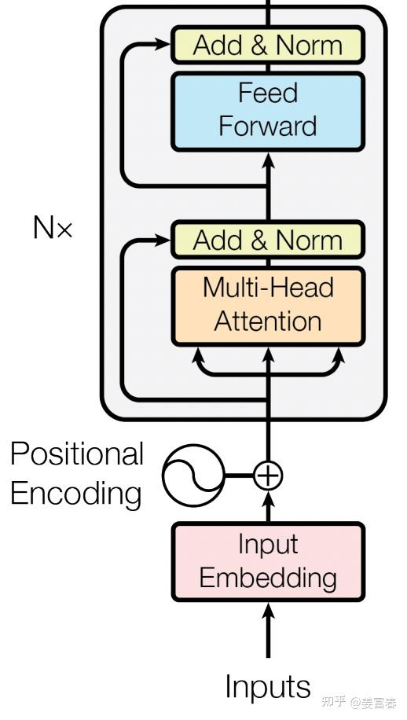
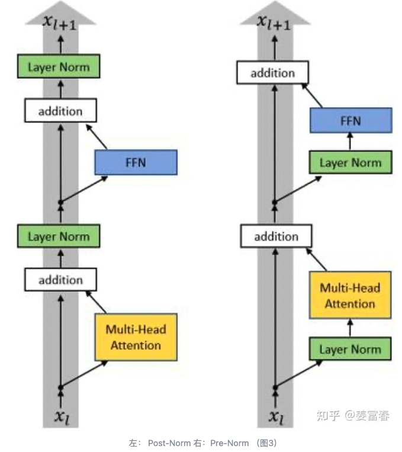
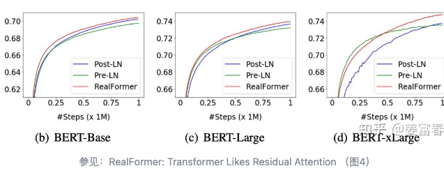

# PreNorm 和 PostNorm

参考文档：https://zhuanlan.zhihu.com/p/12228475399?share_code=12xGWWpWtkA4R&utm_psn=2057602865494074295

transformer 的主体结构没有发生改变，包括4个部分：Multi-Head Attention、Feed Forward Net、残差链接、 Norm层。

 

在这个主体框架下，当前**Norm层有两种不同的放置位置**

- **放在残差链接之前**称为「Pre-Norm」
- **放在残差链接之后**称为「Post-Norm」

$$
\begin{aligned}
&Pre\_Norm:x_{t+1} = x_t + \mathbb{F_t}(Norm(x_t))\\
&Post\_Norm:x_{t+1} = Norm(x_t + \mathbb{F_t}(x_t))
\end{aligned}
$$
直观是一个带着输入做了归一，一个仅仅负责激活的部分，最大可能保留输入自身状态

**问题1**： Transform 中Post-Norm 和 Pre-Norm 哪个效果好？为什么？

有工作已经证明了结论：**Post-Norm的结构迁移性能会更好**，也就是说在Pretraining中，Pre-Norm和Post-Norm都能做到大致相同的结果，但是Post-Norm的Finetune效果明显更好。下图是RealFormer工作里验证的结论：不同size的模型，训练足够的数据，PostNorm效果更好。

模型层数越深，性能越好，Post-Norm相当于增加模型层数

**问题2：**主流模型使用的都是哪种Norm（Post-Norm or Pre-Norm）

我们挑几个典型的模型看下（GPT-1， BERT， GPT-2， Qwen2，LLama2），**查看了HuggingFace的源码**。

- [GPT-1 （行255-行260）](https://link.zhihu.com/?target=https%3A//github.com/huggingface/transformers/blob/main/src/transformers/models/openai/modeling_openai.py%23L255C13-L255C25)： 使用的Post-Norm方法
- [BERT（第468行，第554行）](https://link.zhihu.com/?target=https%3A//github.com/huggingface/transformers/blob/main/src/transformers/models/bert/modeling_bert.py%23L468): 使用的Post-Norm方法
- [GPT-2](https://link.zhihu.com/?target=https%3A//github.com/huggingface/transformers/blob/main/src/transformers/models/gpt2/modeling_gpt2.py%23L614C9-L614C22)（行614-行651）：使用的Pre-Norm方法
- [Qwen2(行595-行614)](https://link.zhihu.com/?target=https%3A//github.com/huggingface/transformers/blob/main/src/transformers/models/qwen2/modeling_qwen2.py%23L595)：使用的Pre-Norm方法
- [LLama2 (行582-行602)](https://link.zhihu.com/?target=https%3A//github.com/huggingface/transformers/blob/main/src/transformers/models/llama/modeling_llama.py%23L582)：使用的Pre-Norm方法

**结论：**

- 小模型时代（GPT-1， BERT ）都使用的是**Post-Norm**方法
- 大模型时代（GPT2， Qwen2，LLama2）都使用的**Pre-Norm**方法

如何解释这个结论？ 这里直接参考[苏神的博客](https://link.zhihu.com/?target=https%3A//kexue.fm/archives/8747)：**Post-Norm很难训练，容易导致梯度消失**