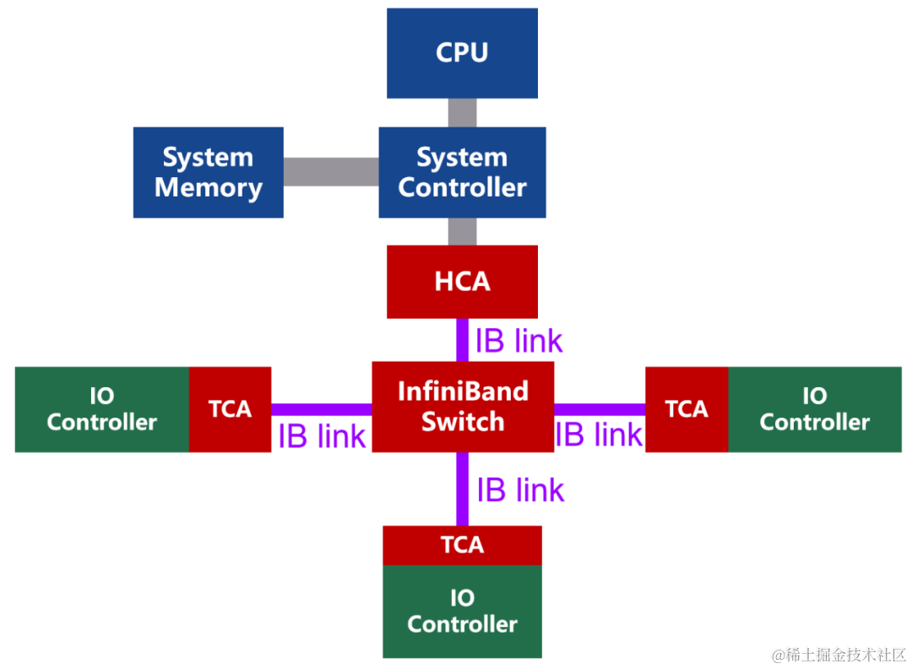
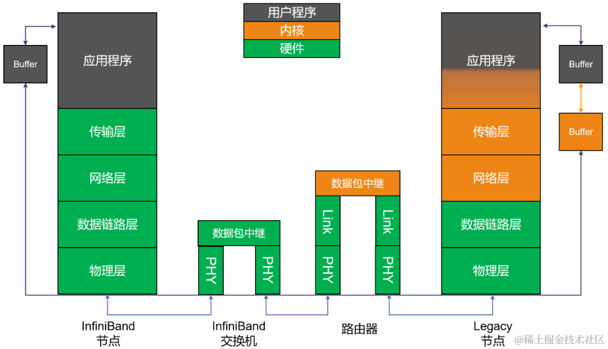

InfiniBand（直译为 “无限带宽” 技术，缩写为IB）是一个为大规模、易扩展机群而设计的**网络通信技术协议**。可用于计算机内部或外部的数据互连，服务器与存储系统之间直接或交换互连，以及存储系统之间的互连。

InfiniBand 最重要的一个特点就是**高带宽**、**低延迟**，因此在高性能计算项目中广泛的应用。 主要用于高性能计算（HPC）、高性能集群应用服务器和高性能存储。

# InfiniteBand网络架构
InfiniBand 是一种基于通道的结构，组成单元主要分为四类：

* HCA（Host Channel Adapter，主机通道适配器）

* TCA（Target Channel Adapter，目标通道适配器）

* InfiniBand link（连接通道，可以是电缆或光纤，也可以是板上链路）

* InfiniBand交换机和路由器（组网用的）

# InfiniBand 的协议栈
InfiniBand 协议同样采用了分层结构，各层相互独立，下层为上层提供服务，如下图所示：

# InfiniBand 常用命令
* ibv_asyncwatch：监视 InfiniBand 异步事件
* ibv_devices 或 ibv_devinfo： 列举 InfiniBand 设备或设备信息 - ibstatus：查询 IB 设备的基本状态
* ibping： 验证 IB 节点之间的连通性
* ibtracert：跟踪 IB 路径
* iblinkinfo：查看IB交换模块的所有端口的连接状态。此命令会将集群内所有的IB交换模块都进行列举。