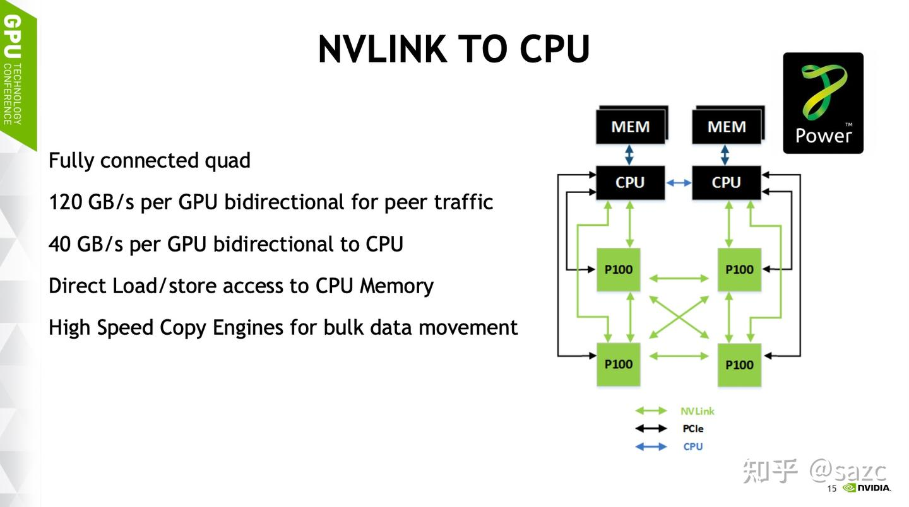
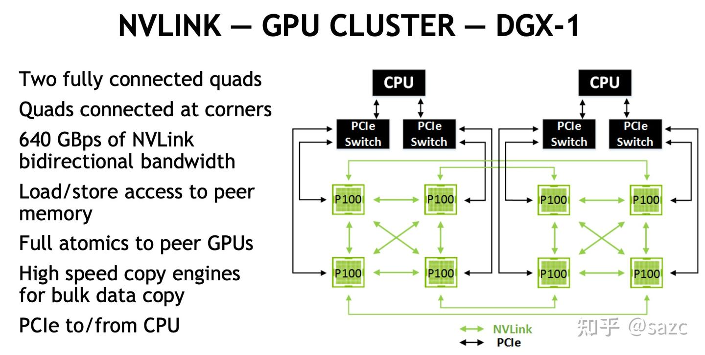
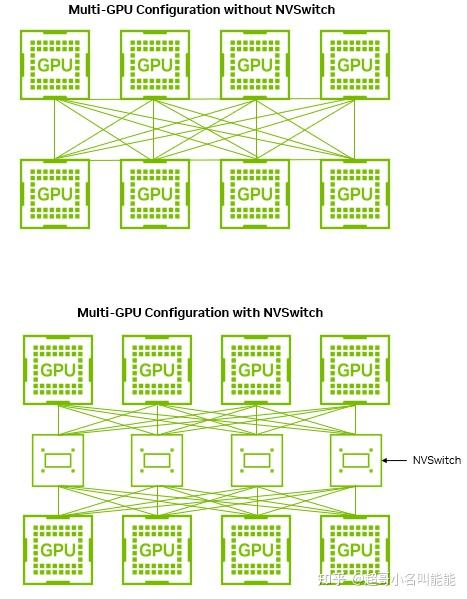
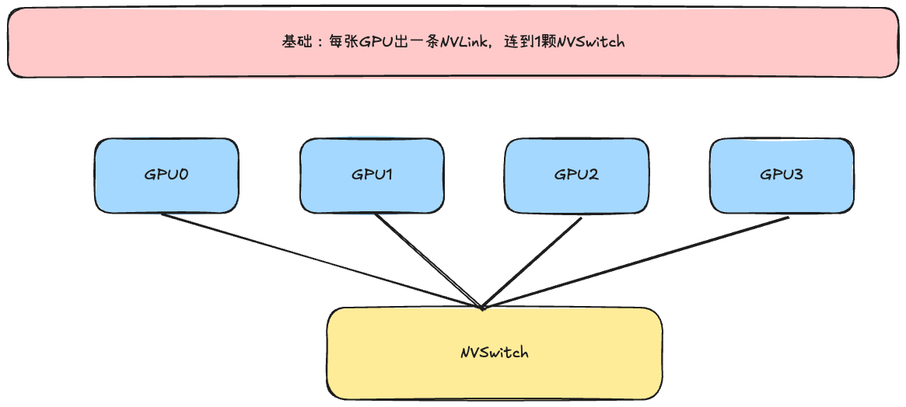
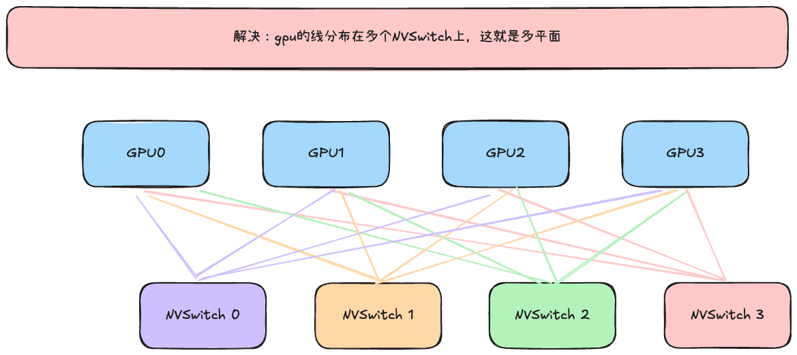
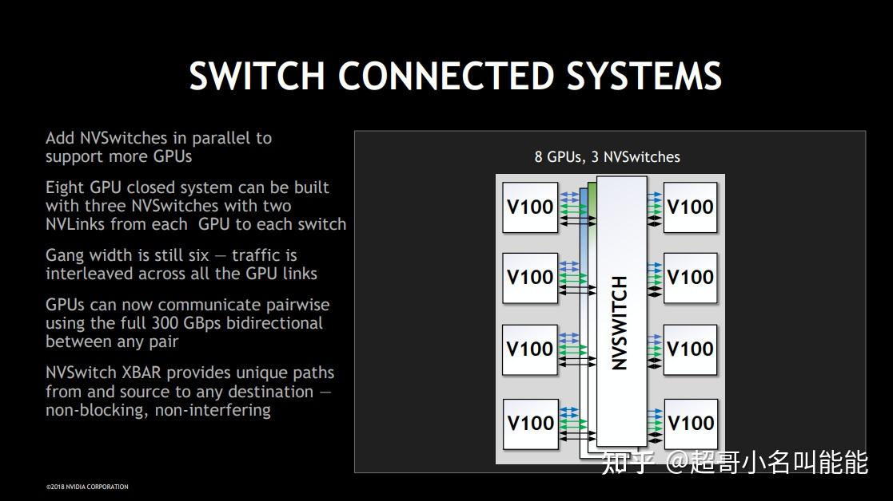
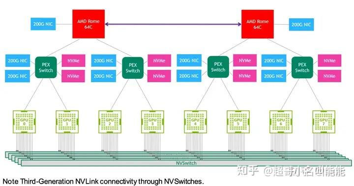
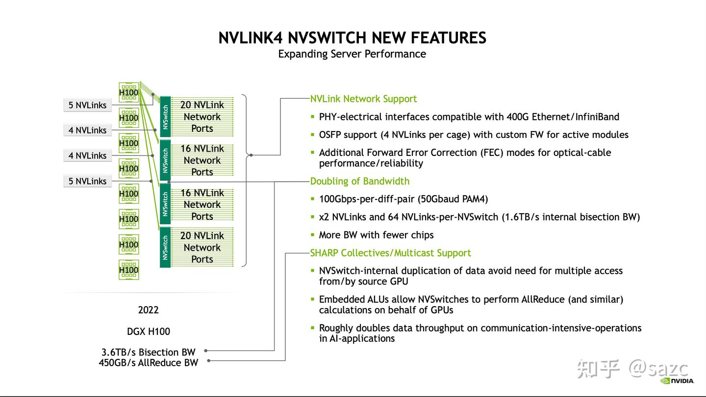

# FullMesh

Fullmesh 是通过nvlink技术形成gpu和gpu之间的一个网络

nvlink 的 产生是为了解决 gpu 与gpu之间传输慢的问题，他是英伟达自研的GPU之间高速直连总线，但是他在gpu上需要专门的Nvlink端口

| GPu  | Nvlink 代 | 链路数 | 单卡双向速度（GB/s） | NV Switch代 |
| :--: | :-------: | :----: | :------------------: | :---------: |
| P100 |    1.0    |   4    |         160          |     无      |
| V100 |    2.0    |   16   |         300          |     1.0     |
| A100 |    3.0    |   12   |         600          |     2.0     |
| H100 |    4.0    |   18   |         900          |     3.0     |
| B200 |    5.0    |   18   |       1.8TB/s        |     4.0     |

## Fullmesh的问题

如图所示，4张p100相连的时候，他需要3个nvlink口进行（p100 有 4 个nvlink口），可以适配，但卡一朵就出问题了，有两个硬伤：

- 线程爆炸，N张卡需要N*（N-1）/2 条线，
- 端口不够：nvlink口是有限的

如果有8张卡的时候，不是真正的fullmesh，注意两套4张p100 之间只有脚点连的Hybrid Cube Mesh

- 走nvlink中转：中间两个p100，需要充当中转，延迟翻倍
- 走pcle绕cpu内存，带宽断崖式下降

【**结论**】：FullMesh只适合小规模的卡玩玩，卡一多就不太行

# NVSwitch

为了解决上述FullMesh的问题，Nvidia 从NVLink（2.0）起，引入NVSwitch（一颗独立的交换芯片，不再GPU里）。NVSwitch也有NVLink端口

所以，他有以下几个优点：

- 不用设置一个GPU作为中转站，计算和通信彻底分开，GPU专心计算，NVSwitch专心做交换

  > A5超节点 IO-Die : 晟腾950把IO剥离成独立的IO-Die，计算Die专心算，IO-Die对外接口

- 绕开了GPU端口的物理上线
- GPU NVlink接口上线，可以通过接NVSwitch完成端口扩展

# NVSwitch 的壮大

## 什么是多平面

gpu 通常会有多个端口，因此不太会是，只有一个连接线连接到这个NVSwitch，也许每个卡都会有4条连接进来，这机会有几个问题：

- NVSwitch需要设置很多端口完成中转
- NVSwich一坏，所有gpu也一块挂机，所以需要完成备份，就是说一个gpu需要同时连接几个NVSwitch

ok，那我们现在就可以看NVSwitch是如何解锁越来越多的端口

| GPU  | NVLink | 链路数（NVlink端口数） | 单卡双向(GB/s) |      NVSwitch      |
| :--: | :----: | :--------------------: | :------------: | :----------------: |
| P100 |  1.0   |           4            |      160       | 无（FullMesh直连） |
| V100 |  2.0   |           6            |      300       |        1.0         |
| A100 |  3.0   |           12           |      600       |        2.0         |
| H100 |  4.0   |           18           |      900       |        3.0         |
| B100 |  5.0   |           18           |    1.8TB/s     |        4.0         |
|      |        |                        |                |                    |

## NVLink 2.0 ：NVSwitch 登场

每个GPU有6个端口，分为三组，每两个连在一个NVSwitch上

## NVLink 3.0 ：A100，机内满血+机外靠网络

A100 有12个NVLink端口，会分在6个NVSwitch上，相较于V100，超平面从3增加到6，

notes：A100的跨机通信靠IB

> [!NOTE]
>
> nvidia的superpod和华为的superpod 不是一回事，nvidia的superpod是参数面（IB）把多台机器连城集群是Scala-Out；华为是把超平面做大，本质是scala-up

## NVLink 4.0:H100，端口开始 "半出主机"

# A3