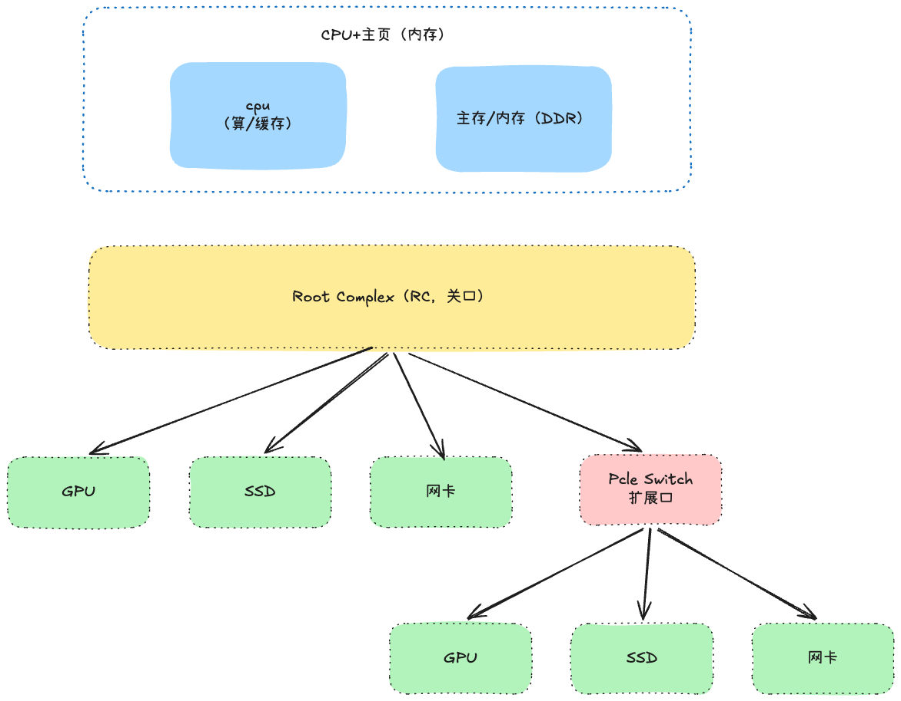
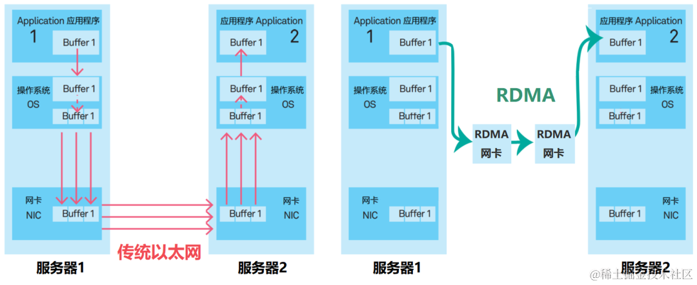

> [!IMPORTANT]
>
> 1. 可以详细说明NCCL，Pcle，Nvlink，RDMA，
> 2. 可以说明超节点的实现逻辑
> 3.

为什么需要超节点？

随着模型参数量的逐步扩大（GPT3 1750亿-》kimi k3 2.8万亿 ），单张显卡的算力和显存早已放不下一个完整的模型了，就算通过量化将模型强行塞入一张卡，速度也会很慢，所以==“多卡协同”==是训练和推理都得面对的刚需

# 通信软件

通信软件指用于分布式训练时，多个计算设备之间的集合通信。在分布式系统中，各个节点间往往存在大量的集合通信需求，而我们可以用消息传递接口 (Message Passing Interface，MPI，一套集合通信相关的接口标准) 来定义一些比较底层的消息通信行为。譬如 Reduce、AllReduce、Scatter、Gather、AllGather 等。

## Open MPI：

Open MPI 是一个开源 MPI（消息传递接口 ）的实现，由学术，研究和行业合作伙伴联盟开发和维护。因此，Open MPI 可以整合高性能计算社区中所有专家，技术和资源，以构建可用的最佳 MPI 库。

## Gloo：

Gloo 是 Facebook 开源的一套集体通信库，提供了对机器学习中有用的一些集合通信算法。如：Barrier，Broadcast，AllReduce。

## NCCL：

NCCL（Nvidia Collective multi-GPU Communication Library）是英伟达基于 NVIDIA GPU 的一套开源的集合通信库，如其官网描述：NVIDIA 集合通信库（NCCL）实现了针对 NVIDIA GPU 性能优化的多 GPU 和多节点集合通信原语。NCCL 提供了诸如 All Gather，All Reduce，Broadcast，Reduce，Reduce-Scatter 等实现，这些实现优化后可以通过 PCIe、 NVLink、InfiniBand 等高速互联，从而实现高带宽和低延迟。

因为 NCCL 是 NVIDIA 基于自身硬件定制的，能做到更有针对性且更方便优化，故在英伟达硬件上，NCCL 的效果往往比其它的通信库更好。

NCCL主要做几件事：探测计算节点的网络设备和拓扑结构，使用算法自动调优选择一个最优的通信方式。

> NCLL关知识详见： [ncll.md](ncll.md)

# 单机多卡

单张卡不够，最简单的方法就是切到多张卡上，同一主机上内多张卡一起参与训练和推理，需要完成卡间建立连接：pcle总线和FullMesh之连（nvlink）

## PCIe

搬运东西需要Root Complex（RC）他是cpu/内存通往PCIe设备的关口，RC会暴露一排端口，每个端口后接入一个设备（GPU，SSD，网卡），也可以是PCIe Switch扩展口

常见 4 种通信场景

**1️⃣ GPU ↔ GPU**

GPU A → （PCIe Switch ） → RC → 内存 → RC → （PCIe Switch )→ GPU B

> 内存读取需 CPU 中断处理

**2️⃣ GPU → SSD**

GPU A → （PCIe Switch ） → RC → 内存 → RC → （PCIe Switch ） → SSD

> **缺陷：** 数据全经内存中转，内存读取又需 CPU 切换

**3️⃣ GPU ↔ 网卡**

网卡 → （PCIe Switch ）→ RC → 内存 → RC → （PCIe Switch ） → GPU 显存

**4️⃣ 网卡 → SSD**

网卡 →（PCIe Switch ）→ RC → 内存 → RC → （PCIe Switch ） → SSD

## FullMesh

PCIe下gpu之间通信要经过内存，带宽有限，延迟也高，可训练时卡间偏偏需要频繁的交换数据，pcle跟不上，而且多个设备同时搬运数据的时候，会发生带宽争抢

显而易见的操作是给gpu之间单独建立一个通信通道，英伟达于是推出了NVLink，带宽比pcle大的多，早期NVLink（1.0 P100时代）就是让多张卡两两直链。这种“两两直连”的组网就是FullMesh。

相较采用PCIe，NVLink技术带宽增加5倍。NVLINK 技术采用了 PCIe Gen4 的高速互连方式，可以提供高达 300 GB/s 的带宽和 1.5 微秒的延迟。

> nvlink相关知识详见： [nvlink.md](nvlink.md)

## GPUDirect Storage

机内要加快的，不只是GPU之间的通信，GPU和其他组件的通信业十分重要，例如：gpu和ssd之间（模型加载，checkpoint保存与恢复，大模型集训练时的数据供给）

GPUDirect Storage就是解决GPU 和 SSD交互之间需要经过内存的场景，让GPU直接写NVMe SSD

> [!NOTE]
>
> 区分概念 NVMe/GDS
>
> NVMe是一个存储访问协议（让软件可以高速访问SSD），它本身走的还是ssd-》内存-〉cpu-》gpu 这条老路，并非发生直连
>
> GDS才是让SSD 直连 gpu的核心，

# 机间通信

一个机器中的卡也是有上限的，所以就需要更多的服务器，常规服务器通信需要走tcp通讯协议很慢，为了服务期间通信的加速，设计了一套协议叫RDMA

## RDMA

DMA（Direct Memory Access， 直接内存访问）

之前设备把数据从内存搬进搬出的活得cpu亲自搬运---- cpu需要停下自己的主要任务，出来搬数据，搬完才能去干的别的活

有了DMA后， 每个外设亲自带一块DMA硬件（GPU叫Copy Engine，SSD叫NVMe 控制器SoC里，网卡叫PCle DMA引擎），cpu只需要下发命令，DMA会自己去搬运数据

RDMA（Remote Direct Memory Access，远程直接内存访问）--- 正常跨机通信是“本机CPU发送-》网卡 -〉网络 -》对端网卡 - 〉 对端cpu -》对端内存”，对于cpu要全程待命， rdma 的作用是 绕过cpu （内存-网卡-网络-网卡-内存）

RDMA只是个概念 - 绕过cpu直接访问对端内存这件事，不是某个具体协议。他有以下几种实现

- **RoCE**：RDMA跑在普通以太网上，好处是便宜，坏处是要靠无损机制保证不丢包，它分为RoCE v1（链路层）和RoCE v2（网络层，可路由），RoCE v2是大众选择方案

- iwarp ：同样是以太网技术

- **InfiniBand（IB）**：另一套自成体系的RDMA网络，贵但性能好（有自己的链路层和交换机，天生低延迟）

> 英伟达跨机网络一般选择用IB，华为A3/A5跨超节点通信用的是RoCE

> 详见 [InfiniteBand(IB).md](InfiniteBand(IB).md)

一定要注意：RDMA是直接读写**<u>对方内存</u>**，所以如果要gpu显存，也就是要相对实现一套GPUDirect Storage （路径：GPU显存 -》本机网卡 -〉网络 -》对端网卡 -〉对端GPU显存） ==这里很直接的直觉是网卡也很多余==

## ROCE

ROCE是RDMA 以太网的一种实现路径，但是他不是随便一个网卡就能跑RDMA，

- RNIC：支持RDMA的网卡，普通网卡做不到“绕过CPU直接动对端内存”，得是专门的RNIC，硬件本身就能直接访问内存

- 注册内存：网卡要直接访问的内存，得先注册给网卡 -- 把内存区域登记下来，锁页（防止被操作系统换出去），这样网卡才能放心的直接DMA这块内存

- 无损网络：RDMA绕过了CPU，一旦丢包恢复代价极高（要靠RNIC硬件重传，会引发吞吐崩塌），所以RoCE靠PFC，ECN这些机制保证不丢包，叫无损网络

# 超节点的核心逻辑

机内的总线直连（纳秒级，带宽上百GB/s），机外是网络转发（微妙级，带宽几十GB/s）---机间比机外块

所以直觉是如果让大家都走总线直连

这就是超节点的核心设计理念，业内把直连尺度做大叫Scale-up,（纵向扩展），把跨节点走网络叫Scale-out，横向扩展

A3（CloudMatrix384）：384张卡，靠两级Clos交换机把直连尺度从单机8卡做到384卡

A5（Atlas 950 SuperPod）：8192张i啊，框内FullMesh + 框间clos，框内连交换机都省了

# 瓶颈 -- 解决方案

## 卡间通讯的瓶颈：

- **通信密集操作挑战**：在数据并行和模型并行场景下，GPU间需要高频进行梯度同步、权重聚合，大量的数据迁移导致通讯开销巨大。
- **计算能力与通讯能力不匹配**：GPU计算能力（算力）提升的速度远快于数据传输速度（层间通信能力），这种失衡导致计算单元往往在等待数据，出现显存利用率低的情况。
- **计算气泡 (Pipeline Bubble)**：分布式并行训练中的流水线并行策略容易产生气泡。如果卡间通信延迟大，气泡会变大，设备闲置时间增加，降低训练效率。
- **网络拓扑与拥塞**：在海量卡片互联时，哈希极化（hash polarization）、网络拓扑盲点、流量拥塞抖动等问题会严重阻塞数据流动。

## 解决方案：

### 扩展 Scale-up 域

**核心思想**：与其无限制地增加服务器节点数量（Scale-out，横向扩展），不如先在单台服务器内部做“加法”，将多个计算芯片（如GPU、NPU）通过超高速内部互联技术整合成一个逻辑上更紧密、物理上更一体的计算单元，即“超级节点”。

优化策略就是：NVLINK等硬件的通讯技术，从网络通信的微秒级降至纳秒级。

### 拓扑感知与优化

**核心思想**：在由多个“超级节点”或普通服务器组成的集群中，**网络不是平的**。不同节点之间的“距离”（通信延迟和带宽）可能不同。拓扑感知就是让任务调度和通信库“看见”并“利用”这种物理拓扑的差异，将通信频繁的进程尽量安排在物理上邻近的节点上，并选择最优的通信路径。

**如何实现优化**：

- **调度器层面**：像Kubernetes的调度器或Slurm，可以感知节点所在的机架、交换机层级，在分配任务时，尽可能将需要频繁通信的Pod或进程分配在同一个机架或相邻的服务器上。
- **通信库层面**：NCCL、HCCL等集合通信库会**在初始化阶段探测集群的网络拓扑**，并为之生成一个最优的通信算法和路径规划。例如，对于All-Reduce操作，它会自动选择是使用树形算法、环形算法还是其他混合算法，来匹配当前的物理网络拓扑，实现全局最优的通信效率。

### 模型下沉技术（Ascend/CANN）

**核心思想**：**“不让CPU成为瓶颈”**。传统模式下，GPU/NPU像一个需要被CPU频繁“投喂”数据和“指挥”的副手。模型下沉旨在让计算芯片**更加自主**，减少对宿主CPU的依赖。

**以华为 Ascend/CANN 为例**：

- **传统流程**：CPU负责控制流（循环、条件判断）、数据预处理、任务调度，并频繁调用AI加速卡进行核心计算（矩阵乘、卷积等）。CPU和加速卡之间需要不断同步。
- **模型下沉**： **整图下沉**：将整个AI计算图（包括复杂的控制流、数据预处理算子等）编译成一个完整的、可由Ascend芯片**独立执行**的任务图。 **自主执行**：CPU只需一次性将任务图和初始数据下发到Ascend芯片，芯片便可以**连续执行**，期间仅在必要时与CPU交互，而不是每一步都需要CPU干预。 **动态Shape支持**：先进的模型下沉技术还能支持动态Shape（可变尺寸输入），无需为每种尺寸重新编译或由CPU频繁介入调整。

**在AI集群中的作用**：

1. **加速梯度同步**：在分布式训练中，All-Reduce操作需要聚合所有GPU的梯度。RDMA/RoCE能将此过程的延迟和CPU开销降至最低。
2. **加速数据加载**：可以从远程存储节点直接RDMA读取训练数据到计算节点的内存或GPU显存，极大加速数据供给流水线。
3. **实现高效的模型并行**：当单台服务器放不下大模型时，不同层的参数分布在不同的节点上，前向/反向传播时，层与层之间需要高速、低延迟的数据传输，这正是RDMA的用武之地。

# 通信密集操作

在数据并行和模型并行训练中，梯度同步（All-Reduce）和参数交换（All-to-All）等操作频繁发生。这些操作依赖高速互联网络（如InfiniBand），但在跨节点场景下，带宽限制和延迟问题显著影响整体吞吐。

- 梯度聚合时，All-Reduce操作的时间随GPU数量线性增长
- 在张量并行中，层内计算需多次跨设备通信，增加等待时间
- 高带宽需求导致网络拥塞，降低有效计算利用率

| 通信模式   | 典型操作        | 通信频率 | 带宽敏感度 |
| :--------- | :-------------- | :------- | :--------- |
| 数据并行   | All-Reduce      | 每步一次 | 高         |
| 张量并行   | All-to-All      | 每层多次 | 极高       |
| 流水线并行 | Micro-batch传输 | 逐微批次 | 中         |

# gpu中操作

**通信模式对比表**

| 操作              | 输入                        | 输出                            | 带宽成本   | 应用场景     |
| ----------------- | --------------------------- | ------------------------------- | ---------- | ------------ |
| **Broadcast**     | 根进程有 M 数据             | 所有进程有 M 数据               | M          | 参数初始化   |
| **AllReduce**     | 每个进程有 M 数据           | 所有进程有归约后的 M 数据       | 2M*(N-1)/N | 梯度同步     |
| **AllGather**     | 每个进程有 M 数据           | 所有进程有 N*M 数据             | M*(N-1)    | 收集所有特征 |
| **ReduceScatter** | 每个进程有 N*M 数据         | 每个进程有 M 数据（归约后分片） | M*(N-1)    | ZeRO 分片    |
| **All-to-All**    | 每个进程有 N*M 数据（分块） | 每个进程重新排列的 N*M 数据     | 2M*(N-1)   | 张量并行转置 |