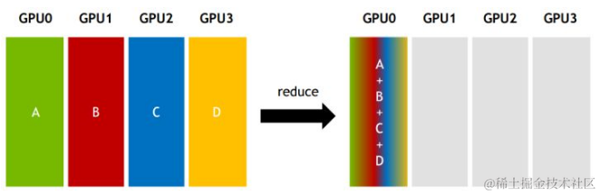
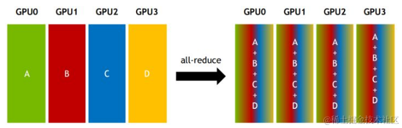
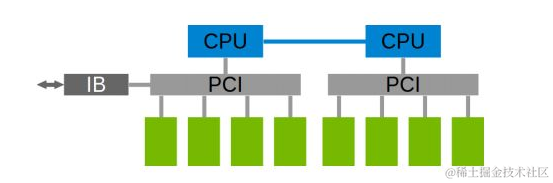
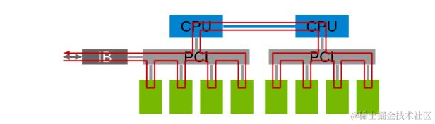
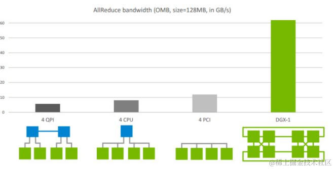
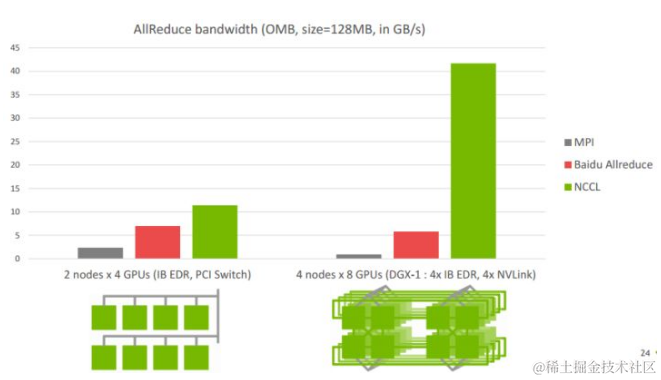

# 通信原语
并行任务的通信一般可以分为 Point-to-point communication 和 Collective communication 。

P2P 通信这种模式只有一个sender和一个receiver，实现起来比较简单。

集合通信包含多个sender多个receiver，一般的通信原语包括broadcast，gather，all-gather，scatter，reduce，all-reduce，reduce-scatter，all-to-all等。

简单介绍几个常用的操作：

* Reduce：从多个sender那里接收数据，最终combine到一个节点上。

* All-reduce：从多个sender那里接收数据，最终combine到每一个节点上。

| 算子              | 语义                                        | 每卡发送量（ring） | 推理中的典型用户                |
| ----------------- | ------------------------------------------- | ------------------ | ------------------------------- |
| **Send/Recv**     | 点对点收发                                  | S                  | PP：stage 边界传 activation     |
| **Broadcast**     | 根 rank 的数据发给全体                      | S（根卡）          | 权重 / 配置分发                 |
| **Reduce**        | 全体数据归约到根                            | (N-1)/N × S        | 少用                            |
| **AllReduce**     | 归约结果人手一份（= RS + AG）               | 2(N-1)/N × S       | TP：attn/MLP 输出归约           |
| **ReduceScatter** | 归约后按 rank 切片，各拿一块                | (N-1)/N × S        | SP、DP attention 的 token 聚合  |
| **AllGather**     | 各 rank 分片拼成完整张量                    | (N-1)/N × S        | SP、DP attention 的 token 聚合  |
| **AllToAll**      | 第 i 卡发给第 j 卡的是**不同**的数据（转置式重分布） | 取决于路由  | EP：MoE 的 dispatch / combine   |

# NCCL 实现
NCCL 实现成 CUDA C++ kernels，包含3种 primitive operations： Copy，Reduce，ReduceAndCopy。

NCCL 1.0 版本只支持单机多卡，卡之间通过 PCIe、NVlink、GPUDirect P2P 来通信。

NCCL 2.0 支持多机多卡，多机间通过 Sockets (Ethernet) 或者 InfiniBand with GPUDirect RDMA 通信。
> nccl无需与nvlink保持版本一致，会自行检测nvlink版本决定走什么
>
单机内多卡通过PCIe以及CPU socket通信。

多机通过InfiniBand通信，在多机多卡内部，也要构成一个通信环。

# 对比 NCCL 在不同硬件架构下网络带宽
下图是 Allreduce 在单机不同架构下的速度比较：

前面三个是单机多卡典型的三种连接方式：
* 第一种是两个GPU通过CPU然后通过QPI和另一个CPU上的两块卡相连，因此速度最慢，但也能达到>5GB/s。
* 第二种是两个GPU通过PCIe switch相连后再经过CPU连接，速度会稍微低一点。

* 第三种是四张卡都在一个PCIe switch上，所以带宽较高，能达到>10GB/s PCIe的带宽大小。
第四种是DGX-1架构，这是Nvidia推出的深度学习平台，带宽能达到60GB/s。

下图是 Allreduce 多机下的速度表现。其中，左图2机8卡，机内PCIe，机间InfiniBand能达到>10GB/s的速度，InfiniBand基本上能达到机内的通信速度；右图4机32卡，机内NVLink，机间InfiniBand，带宽能达到>40GB/s。

# NCCL 常见的环境变量设置
## NCCL_P2P_DISABLE

该变量禁用 P2P 传输，该传输使用 NVLink 或 PCI 在GPU之间使用CUDA直接访问。

设定为 1 相当于设置 NCCL_P2P_LEVEL=0，并且会被 NCCL_P2P_LEVEL 的值所覆盖。

## NCCL_P2P_LEVEL：

该变量允许用户精细地控制何时在GPU之间使用 P2P 传输。该级别定义了NCCL将使用P2P传输的GPU之间的最大距离。

如果未指定，NCCL 将尝试根据其运行的体系结构和环境来最佳选择一个值。

可选值：

LOC：从不使用P2P（始终禁用）
NVL ：当 GPU 通过 NVLink 连接时使用 P2P
PIX ：当 GPU 位于同一 PCI 交换机上时使用 P2P。
PXB：当 GPU 通过 PCI 交换机（可能是多跳）连接时使用 P2P。
PHB ：当 GPU 位于同一 NUMA 节点上时使用 P2P。 流量将通过 CPU。
SYS ：在 NUMA 节点之间使用 P2P，可能跨越 SMP 互连（例如：QPI/UPI）。
NCCL_NET_GDR_LEVEL：

该变量允许用户精细控制何时在NIC和GPU之间使用GPUDirect RDMA。该级别定义NIC和GPU之间的最大距离。

如果未指定，NCCL 将尝试根据其运行的体系结构和环境来最佳选择一个值。

可选值：

LOC：从不使用 GPU Direct RDMA。（始终禁用）
PIX：当 GPU 和 NIC 位于同一 PCI 交换机上时，使用 GPU Direct RDMA。
PXB：当 GPU 和 NIC 通过 PCI 交换机（可能是多跳）连接时，使用 GPU Direct RDMA。
PHB ：当 GPU 和 NIC 位于同一 NUMA 节点上时，使用 GPU Direct RDMA。 流量将通过 CPU。
SYS ：即使跨 NUMA 节点之间的 SMP 互连（例如 QPI/UPI）也使用 GPU Direct RDMA。 （始终启用）

## NCCL_NET_GDR_READ：

只要 GPU-NIC 距离在 NCCL_NET_GDR_LEVEL 指定的距离内，NCCL_NET_GDR_READ 变量就会在发送数据时启用 GPU Direct RDMA。

2.4.2之前，默认情况下禁用GDR读取，即发送数据时，数据先存储在 CPU 内存中，然后再发送到 InfiniBand 卡。
自 2.4.2 起，基于 NVLink 的平台默认启用 GDR 读取。
注意：已知在某些平台（例如：PCI-E）上，发送数据时直接从 GPU 内存读取比从 CPU 内存读取稍慢。

可选值为0或1。定义并设置为1以使用GPU Direct RDMA直接将数据发送到NIC（绕过CPU）。

在 2.4.2 之前，所有平台的默认值都是 0。 自 2.4.2 起，基于 NVLink 的平台的默认值为 1，否则为 0。

## NCCL_IB_DISABLE：

该变量将禁用 NCCL 要使用的IB传输。NCCL 将使用IP sockets 。

定义并设置为1以强制使用IP sockets 。

## NCCL_SOCKET_IFNAME：

指定NCCL使用的SOCKET网卡。如：NCCL_SOCKET_IFNAME=bond0,eth0。

## NCCL_IB_HCA

该变量指定要用于通信的 RDMA 接口。使用IB通信必须要设置的（指定NCCL使用的IB网卡）。 可以通过 ibstat 查看IB网卡名。

用法：

定义一个前缀列表来过滤要由 NCCL 使用的接口。使用 ^ 符号，NCCL 将排除以列表中任何前缀开头的接口。还可以使用 : 符号来指定特定的端口。要匹配（或不匹配）确切的接口名称而不是前缀，在字符串前面加上 = 字符。

示例：

mlx5：使用以 mlx5 开头的所有卡的所有端口。
=mlx5_0:1,mlx5_1:1：使用卡 mlx5_0 和 mlx5_1 的端口 1。
^=mlx5_1：不使用卡 mlx5_1。
比如： NCCL_IB_HCA=mlx5_2,mlx5_3,mlx5_4,mlx5_5

注意：
如果不加前缀 =，使用 mlx5_1 将同时选择 mlx5_1 和 mlx5_10 到 mlx5_19（如果存在）。因此，始终建议添加前缀 = 以确保精确匹配。
使用建议：

通过这个环境变量可以调整NIC（Network Interface Controller）数量，NIC 通常是一块插入计算机主板上的扩展卡，更多NIC，节点带宽更大。通过控制NIC数量可以控制节点间通信带宽。

## NCCL_IB_TIMEOUT：

该变量用于控制InfiniBand Verbs超时。取值范围1-22。

超时时间的计算公式为4.096微秒 * 2 ^ timeout，正确的值取决于网络的大小。增加该值可以在非常大的网络上提供帮助，例如，如果NCCL在调用ibv_poll_cq时出现错误12。

使用建议：

在大模型训练任务中设置成最大值22，可以减少不少nccl timeout异常。

## NCCL_IB_RETRY_CNT

该变量控制 InfiniBand 的重试次数。

使用建议：

在大模型训练任务中设置成13，尽可能多重试。

## NCCL_PXN_DISABLE：

禁止使用非本地 NIC 的进行节点间通信，使用 NVLink 和一个中间 GPU。

使用建议：

设置成1。在PyTorch中进行跨节点all-to-all通信时，如果该环境变量是0会出现异常。

## NCCL_DEBUG_FILE：

设置一个文件地址，变量用于将NCCL的调试日志输出到文件中，有助于调试NCCL。

NCCL_IB_PCI_RELAXED_ORDERING：

启用 IB Verbs 传输的 Relaxed Ordering。Relaxed Ordering可以极大地提高虚拟化环境下 InfiniBand 网络的性能。

传统的顺序执行（Strict Ordering）要求数据在发送和接收之间按照严格的顺序进行传输和处理。这种机制可以确保数据的顺序性，但可能会导致性能瓶颈，特别是在高负载和复杂通信模式下。

而Relaxed Ordering允许数据在发送和接收之间进行乱序传输和处理。这意味着系统可以更灵活地调度和处理数据，提高并行性和吞吐量。Relaxed Ordering 机制在虚拟化环境中尤其有益，因为它可以减少虚拟机之间的争用和延迟，提高整体性能。

接受的取值：

设置为 2，如果可用，自动使用Relaxed Ordering。
设置为 1，强制使用Relaxed Ordering，如果不可用，则失败。
设置为 0，禁用使用Relaxed Ordering。
默认值为 2。建议设置成 1。

## NCCL_SHM_DISABLE：

该变量禁用共享内存（SHM）传输。

在P2P不能生效的情况下，是否使用CPU的共享内存来传输数据。 当 SHM 禁用时，NCCL 使用网络（ InfiniBand 或 IP sockets）在 CPU sockets 之间进行通信。