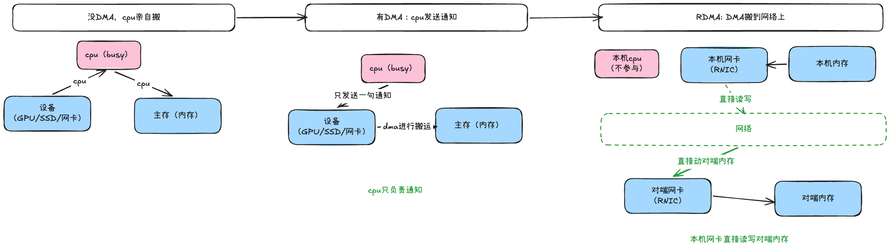
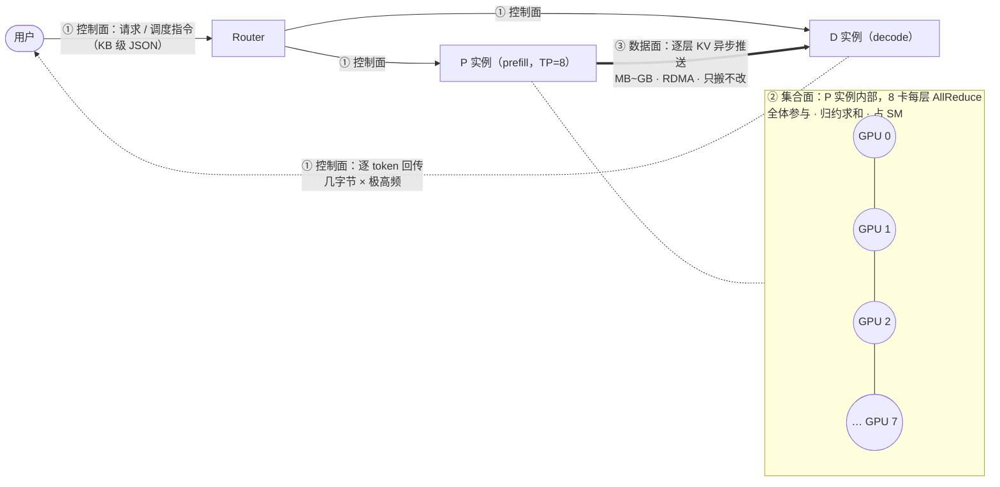

> [!IMPORTANT]
>
> 1. 可以详细说明NCCL，Pcle，Nvlink，RDMA，
> 2. 可以说明超节点的实现逻辑
> 3.


为什么需要超节点？

随着模型参数量的逐步扩大（GPT3 1750亿-》kimi k3 2.8万亿 ），单张显卡的算力和显存早已放不下一个完整的模型了，就算通过量化将模型强行塞入一张卡，速度也会很慢，所以==“多卡协同”==是训练和推理都得面对的刚需

# 通信软件

通信软件指用于分布式训练时，多个计算设备之间的集合通信。在分布式系统中，各个节点间往往存在大量的集合通信需求，而我们可以用消息传递接口 (Message Passing Interface，MPI，一套集合通信相关的接口标准) 来定义一些比较底层的消息通信行为。譬如 Reduce、AllReduce、Scatter、Gather、AllGather 等。

## Open MPI：

Open MPI 是一个开源 MPI（消息传递接口 ）的实现，由学术，研究和行业合作伙伴联盟开发和维护。因此，Open MPI 可以整合高性能计算社区中所有专家，技术和资源，以构建可用的最佳 MPI 库。

## Gloo：

Gloo 是 Facebook 开源的一套集体通信库，提供了对机器学习中有用的一些集合通信算法。如：Barrier，Broadcast，AllReduce。

## NCCL：

NCCL（Nvidia Collective multi-GPU Communication Library）是英伟达基于 NVIDIA GPU 的一套开源的集合通信库，如其官网描述：NVIDIA 集合通信库（NCCL）实现了针对 NVIDIA GPU 性能优化的多 GPU 和多节点集合通信原语。NCCL 提供了诸如 All Gather，All Reduce，Broadcast，Reduce，Reduce-Scatter 等实现，这些实现优化后可以通过 PCIe、 NVLink、InfiniBand 等高速互联，从而实现高带宽和低延迟。

因为 NCCL 是 NVIDIA 基于自身硬件定制的，能做到更有针对性且更方便优化，故在英伟达硬件上，NCCL 的效果往往比其它的通信库更好。

NCCL主要做几件事：探测计算节点的网络设备和拓扑结构，使用算法自动调优选择一个最优的通信方式。

> NCLL关知识详见： [ncll.md](ncll.md)

# 单机多卡

单张卡不够，最简单的方法就是切到多张卡上，同一主机上内多张卡一起参与训练和推理，需要完成卡间建立连接：pcle总线和FullMesh之连（nvlink）

## PCIe

搬运东西需要Root Complex（RC）他是cpu/内存通往PCIe设备的关口，RC会暴露一排端口，每个端口后接入一个设备（GPU，SSD，网卡），也可以是PCIe Switch扩展口


常见 4 种通信场景

**1️⃣ GPU ↔ GPU**

GPU A → （PCIe Switch ） → RC → 内存 → RC → （PCIe Switch )→ GPU B

> 内存读取需 CPU 中断处理

**2️⃣ GPU → SSD**

GPU A → （PCIe Switch ） → RC → 内存 → RC → （PCIe Switch ） → SSD

> **缺陷：** 数据全经内存中转，内存读取又需 CPU 切换

**3️⃣ GPU ↔ 网卡**

网卡 → （PCIe Switch ）→ RC → 内存 → RC → （PCIe Switch ） → GPU 显存

**4️⃣ 网卡 → SSD**

网卡 →（PCIe Switch ）→ RC → 内存 → RC → （PCIe Switch ） → SSD

## FullMesh

PCIe下gpu之间通信要经过内存，带宽有限，延迟也高，可训练时卡间偏偏需要频繁的交换数据，pcle跟不上，而且多个设备同时搬运数据的时候，会发生带宽争抢

显而易见的操作是给gpu之间单独建立一个通信通道，英伟达于是推出了NVLink，带宽比pcle大的多，早期NVLink（1.0 P100时代）就是让多张卡两两直链。这种“两两直连”的组网就是FullMesh。

相较采用PCIe，NVLink技术带宽增加5倍。NVLINK 技术采用了 PCIe Gen4 的高速互连方式，可以提供高达 300 GB/s 的带宽和 1.5 微秒的延迟。

> nvlink相关知识详见： [nvlink.md](nvlink.md)

## GPUDirect Storage

机内要加快的，不只是GPU之间的通信，GPU和其他组件的通信业十分重要，例如：gpu和ssd之间（模型加载，checkpoint保存与恢复，大模型集训练时的数据供给）

GPUDirect Storage就是解决GPU 和 SSD交互之间需要经过内存的场景，让GPU直接写NVMe SSD

> [!NOTE]
>
> 区分概念 NVMe/GDS
>
> NVMe是一个存储访问协议（让软件可以高速访问SSD），它本身走的还是ssd-》内存-〉cpu-》gpu 这条老路，并非发生直连
>
> GDS才是让SSD 直连 gpu的核心，


# 机间通信

一个机器中的卡也是有上限的，所以就需要更多的服务器，常规服务器通信需要走tcp通讯协议很慢，为了服务期间通信的加速，设计了一套协议叫RDMA

## RDMA

DMA（Direct Memory Access， 直接内存访问）

之前设备把数据从内存搬进搬出的活得cpu亲自搬运---- cpu需要停下自己的主要任务，出来搬数据，搬完才能去干的别的活

有了DMA后， 每个外设亲自带一块DMA硬件（GPU叫Copy Engine，SSD叫NVMe 控制器SoC里，网卡叫PCle DMA引擎），cpu只需要下发命令，DMA会自己去搬运数据



RDMA（Remote Direct Memory Access，远程直接内存访问）--- 正常跨机通信是“本机CPU发送-》网卡 -〉网络 -》对端网卡 - 〉 对端cpu -》对端内存”，对于cpu要全程待命， rdma 的作用是 绕过cpu （内存-网卡-网络-网卡-内存）


RDMA只是个概念 - 绕过cpu直接访问对端内存这件事，不是某个具体协议。他有以下几种实现

- **RoCE**：RDMA跑在普通以太网上，好处是便宜，坏处是要靠无损机制保证不丢包，它分为RoCE v1（链路层）和RoCE v2（网络层，可路由），RoCE v2是大众选择方案

- iwarp ：同样是以太网技术

- **InfiniBand（IB）**：另一套自成体系的RDMA网络，贵但性能好（有自己的链路层和交换机，天生低延迟）

> 英伟达跨机网络一般选择用IB，华为A3/A5跨超节点通信用的是RoCE

> 详见 [InfiniteBand(IB).md](InfiniteBand(IB).md)


一定要注意：RDMA是直接读写**<u>对方内存</u>**，所以如果要gpu显存，也就是要相对实现一套GPUDirect Storage （路径：GPU显存 -》本机网卡 -〉网络 -》对端网卡 -〉对端GPU显存） ==这里很直接的直觉是网卡也很多余==


## ROCE

ROCE是RDMA 以太网的一种实现路径，但是他不是随便一个网卡就能跑RDMA，

- RNIC：支持RDMA的网卡，普通网卡做不到“绕过CPU直接动对端内存”，得是专门的RNIC，硬件本身就能直接访问内存

- 注册内存：网卡要直接访问的内存，得先注册给网卡 -- 把内存区域登记下来，锁页（防止被操作系统换出去），这样网卡才能放心的直接DMA这块内存

- 无损网络：RDMA绕过了CPU，一旦丢包恢复代价极高（要靠RNIC硬件重传，会引发吞吐崩塌），所以RoCE靠PFC，ECN这些机制保证不丢包，叫无损网络


# 超节点的核心逻辑

机内的总线直连（纳秒级，带宽上百GB/s），机外是网络转发（微妙级，带宽几十GB/s）---机间比机外块

所以直觉是如果让大家都走总线直连

这就是超节点的核心设计理念，业内把直连尺度做大叫Scale-up,（纵向扩展），把跨节点走网络叫Scale-out，横向扩展

A3（CloudMatrix384）：384张卡，靠两级Clos交换机把直连尺度从单机8卡做到384卡

A5（Atlas 950 SuperPod）：8192张i啊，框内FullMesh + 框间clos，框内连交换机都省了

# 集群通信
推理引擎的集群里，其实同时跑着**三条完全独立的通信链路**。按**数据多大、谁在参与、能不能等**来划分，它们的诉求、协议、优化手段几乎没有交集：

| 链路                                 | 传输内容                         | 特征                                    | 典型技术                        | 优化目标             |
| ------------------------------------ | -------------------------------- | --------------------------------------- | ------------------------------- | -------------------- |
| **控制面**（Router/EngineCore↔Worker） | 请求元数据、调度指令、token 输出 | 小消息（字节~KB）、高频、必须可靠          | ZMQ / gRPC / HTTP / Ray actor   | 不阻塞主循环、低抖动 |
| **数据面**（P↔D）                    | KV Cache 张量                    | 大块（MB~GB）、一次性、单向、可容忍重传 | RDMA / NIXL / Mooncake / NVLink | 带宽打满、隐藏延迟   |
| **集合通信面**（全体 rank）          | TP 的 AllReduce、EP 的 AllToAll  | 中等块（KB~百 MB）、同步、严格多对多    | NCCL / HCCL / RCCL              | 延迟最小化、不抢 SM  |

控制面走 TCP 图的是"可靠"，数据面走 RDMA 图的是"绕开 CPU"，集合面走 NCCL 图的是"同步语义"。

一句话总纲：**控制面是"传话"，数据面是"搬运"，集合通信是"分布式算子"。**

## 读前扫盲：高频黑话速查

| 术语 | 人话解释 |
| ---- | -------- |
| **rank** | 参与通信的一个进程，通常一张 GPU 对应一个 rank |
| **P / D 实例** | P＝Prefill（负责算 prompt），D＝Decode（负责逐 token 生成），PD 分离部署的两类角色 |
| **SM** | GPU 的"CPU 核"（Streaming Multiprocessor）。说"占 SM"就是"占 GPU 算力" |
| **DMA / RDMA** | DMA：硬件自己搬数据、不占 CPU；RDMA：远程版 DMA，绕过两端 CPU 直接读写对端内存/显存 |
| **QP** | Queue Pair，RDMA 的"连接句柄"，使用前要先注册内存、建好 QP（所以小消息用它不划算） |
| **AllReduce** | 多卡数据归约（如逐元素求和）后，每卡都拿到一份完整结果 |
| **RS / AG** | ReduceScatter（归约后按卡切片分发）/ AllGather（各卡分片拼成完整张量） |
| **栅栏（Barrier）** | 全体到齐才能继续，最慢的人拖住所有人 |
| **TPOT / ITL** | decode 的延迟指标：每个输出 token 的耗时 / 相邻两个 token 之间的间隔 |
| **busbw** | 集合通信的带宽利用率指标（"互连实际被吃掉多少"），详见 Ring AllReduce 一节 |
| **P2P** | 有两个意思：① point-to-point（点对点传输）；② peer-to-peer（卡间直访显存）。按语境区分，别和 P↔D（Prefill/Decode）搞混 |

## 总览：一个请求的三种流量



图例：普通箭头＝控制面；粗箭头＝数据面（KV 搬运）；虚线箭头＝控制面的 token 回传流；虚线框＝P 实例内部的集合通信。

- ① **控制面**：Router 挑定 P、D 实例下发调度指令（KB 级 JSON）；D 侧逐 token 回传（每次几字节、极高频）。
- ② **集合面**（P 实例内部，TP=8）：每层算完，8 张卡把各自的 1/8 结果 AllReduce 归约——全体参与，算完才能进下一层。
- ③ **数据面**（P→D）：每层 KV 算完就异步推给 D——MB~GB，只有两方参与。

**注意 ② 和 ③**：同一时刻、同一个 P 实例内部跑着两种流量，性质却完全不同——这就是本章要分清的核心。

### 为什么必须分三条链路：属性不可调和

不是"人们选了三种方案"，而是三种流量的物理属性互相冲突，硬塞进一个方案必然两头不讨好：

| 矛盾               | 控制面                    | 数据面                     | 集合面                         |
| ------------------ | ------------------------- | -------------------------- | ------------------------------ |
| **参与方**         | 2 个（Router↔Worker）     | 2 个（P↔D）                | N 个（全体 rank）              |
| **量级**           | 字节~KB                   | MB~GB                      | KB~百 MB（decode 小、prefill 大） |
| **频率**           | 极高（每 token 一次）     | 低（每请求一次）           | 极高（每层一次）               |
| **能不能等**       | 不能等（吐 token 要实时） | **能等**（可以后台慢慢搬） | **不能等**（算完才能进下一层） |
| **数据要不要被改** | 不改                      | 不改，只搬                 | **要改**，要归约求和           |

教科书把三者统称"通信"，但它们物理上干的不是一回事。**总根因在最后一行"数据要不要被改"**：数据面只搬不改，所以可以纯 DMA、完全异步、失败重传；集合面要归约，所以必须全体同步、SM 参与计算、慢 rank 拖住全体。这也解释了三面的优化目标为何截然不同。

## 控制面通信

**负责进程 / 服务之间的管理与调度**，消息是 KB 级结构化数据（JSON / msgpack）。可以把它想象成"传令兵"：每条消息都很小，但一条都不能丢、还不能迟到。

### vLLM V1 进程模型

```
API Server 进程(s)  ──ZMQ + msgpack──>  EngineCore 进程  ──collective_rpc──>  GPU Worker 进程
 (tokenize/detokenize)                  (scheduler + KV mgr)                    (每 GPU 一个)
                                              │
                                    DP Coordinator（仅 DP>1 时才启动）
```

- 进程数公式：`A(API) + DP(EngineCore) + DP×TP×PP(Worker) +（仅 DP>1 时再 +1 个 DP Coordinator）`。一台 4 卡 `-tp=4`（DP=1）：1 + 1 + 4 = **6 个进程**；DP Coordinator 只在 DP>1 时存在（源码里直接 `assert dp_size > 1`），负责收集各副本负载、做全局调度。
- 序列化用 **msgspec / msgpack** 而非 pickle（类型安全 + 快 10–50 倍 + 无反序列化 RCE 风险；RCE＝远程代码执行——pickle 反序列化恶意数据可执行任意代码）；大张量（如多模态输入）走 `tensor_ipc.py` 的共享内存通道（API server → EngineCore），零拷贝、不过序列化。
- 多进程设计的两个动机，面试要能说出：**规避 GIL**（Python 同一进程同一时刻只有一个线程在执行，把引擎和前端拆开，事件循环才不会被 busy loop 卡住）+ **崩溃隔离**（CUDA fault 不拖垮前端，通过 `EngineDeadError` 上报）。

### SGLang 进程模型（对比着记）

```
HTTP Server ─┐
             ├─ TokenizerManager（主进程，ReqState 追踪）
             │        │ ZMQ PUSH
             │        ▼
             │    Scheduler（子进程，RadixCache + 组批 + event_loop_overlap）
             │        │ ZMQ PUSH
             │        ▼
             └─ DetokenizerManager（子进程，增量解码）
                      │ ZMQ PUSH 回 TokenizerManager
```

三段式流水，ZMQ PUSH 队列把各阶段解耦。消息结构统一定义在 `srt/managers/io_struct.py`，是系统的"通用语言"。

### 节点内进程间通信手段全景

同一台机器里，进程之间可选的"传话方式"从轻到重大致如下：

| 手段                               | 适用                | 说明                                                    |
| ---------------------------------- | ------------------- | ------------------------------------------------------- |
| **ZMQ (IPC transport)**            | 控制面              | 消息库，同机走 Unix domain socket，避开 TCP 栈开销，兼容 asyncio |
| **CUDA IPC**（`cudaIpcMemHandle`） | 同机跨进程 GPU 张量 | 直接映射对端进程显存，零拷贝；vLLM 的 Custom AllReduce 初始化就是用它互换各 rank 的 buffer 句柄 |
| **共享内存 / tensor_ipc**          | 同机大张量          | 零拷贝，需自行做同步（信号量/event）                    |
| **Unix socket / named pipe**       | 简单控制            | 轻量                                                    |
| **gRPC / HTTP**                    | 跨节点控制面        | Router ↔ worker、服务发现、健康检查                     |
| **etcd / NATS / Ray**              | 集群级协调          | 成员管理、角色注册、配置分发                            |

### 为什么控制面不走 RDMA / NCCL

- **不走 RDMA**：建链成本（注册内存、建 QP）远高于小消息本身收益——为发 100 字节去注册内存，得不偿失。
- **不走 NCCL**：NCCL 是集合语义，Router 和 Worker 之间根本不构成"通信域"。
- 控制面要的是**可靠投递、可观测、易调试**——TCP/gRPC 的生态（重试、超时、链路追踪、健康检查）才是刚需。分离三面的本质是**让每种流量走它最擅长的通道**。

## 数据面通信

**P→D 的 KV Cache 搬运，字节级 1:1 复制**——搬过去就完事，一个字节都不用改：

```
P 的显存: [K1 V1 K2 V2 ... Kn Vn]  ──搬运──>  D 的显存: [K1 V1 K2 V2 ... Kn Vn]
                                        内容完全一样，只是换了地方
```

正因为"只搬不改"，它可以：

- **纯 DMA**：网卡硬件直接读写显存，GPU 完全不参与，不占一个 SM
- **完全异步**：扔给网卡后 GPU 继续算下一层，传完通知一声即可
- **失败可容忍**：顶多这个请求回退重算，其他请求毫发无损

（PD 分离为什么值得做，见 `../prefill 与 Decode 调度/pd.md`；这里只关心 KV 怎么搬。）

### 传输量估算：先算清要搬多少字节

每个 token 的 KV Cache 大小（bf16 单副本）：

```
KV_bytes/token = 2(K和V) × n_layers × n_kv_heads × head_dim × dtype_bytes ÷ tp_size
```

以 Llama-3.1-70B（80 层，GQA 8 个 KV 头——多个 Q 头共享少量 KV 头，KV 才这么小，head_dim=128）为例：`2 × 80 × 8 × 128 × 2B = 320 KB/token`。

- 一个 8K prompt 的 KV ≈ **2.6 GB**；单张 400G 网卡（≈50 GB/s 单向）传完 ≈ **52 ms**；Mooncake 4×200G 实测 87 GB/s 也要 ≈ 30 ms。
- 这个量级划定了 PD 分离的收益边界：**调度上省下的干扰时间必须大于 KV 传输时间**，否则分离反而更慢。
- 数据面所有优化归为两条路：**少传**（prefix 复用、增量传输、FP8 KV 减半）或**传得快且藏进计算**（下面四条）。

## 集合通信面

与数据面的"纯搬运"不同，集合通信是**分布式算子**：数据要被归约、重排，由 SM 上的 kernel 驱动执行，**占用 GPU 计算资源**。（集合通信＝一组卡共同完成的"通信 + 计算"，不只是把数据送到。）

### 并行策略下的通信开销

| 并行策略 | 通信算子                                        | 单次大小                        | 关键特征                                              | 部署原则                  |
| -------- | ----------------------------------------------- | ------------------------------- | ----------------------------------------------------- | ------------------------- |
| **TP**   | 每层 2 次 AllReduce（out_proj、down_proj 后）   | tokens × hidden × dtype         | decode 时消息小、延迟敏感，通信在关键路径上           | 必须留在 NVLink 域（单机）|
| **SP**   | 用 ReduceScatter + AllGather 替代 TP 的 AllReduce | 总量不变，LayerNorm 也分片计算 | 与 TP 组合使用                                        | 同 TP                     |
| **PP**   | P2P Send/Recv（stage 边界）                     | micro-batch × hidden，很小      | 带宽不敏感，怕 bubble（流水线空转，用 micro-batch 填）| 跨节点首选                |
| **DP**   | 推理稳态按请求路由，几乎无集合通信              | —                               | DeepSeek 式 DP attention 变体才需要跨 DP 组聚合 token | 跨节点                    |
| **EP**   | 每个 MoE 层 2 次 AllToAll（dispatch + combine） | tokens × hidden × dtype（dispatch/combine 各一次） | 动态路由 → 负载不均 → 慢专家拖住栅栏；decode 延迟极敏感 | 跨节点 + 专用库（DeepEP） |
| **CP**   | AllGather KV / Ring Attention 的 P2P            | 随序列长度增长                  | 超长上下文 prefill 才用                               | 少见于通用推理            |

训练与推理对集合通信的要求有本质差异：训练的通信可被大 batch 摊薄、可与反向传播重叠，目标是**吞吐**；推理 decode 每步都有一条小消息 AllReduce/AllToAll 在关键路径上，直接进入 TPOT/ITL，目标是**微秒级延迟**。这是推理引擎愿意为集合通信做深度定制（见「推理引擎的定制」）的根本原因。


# 问题

## 为什么 KV 传输不走 NCCL：NCCL vs NIXL / Mooncake

推理的 KV 传输本质是"一次性大块搬运 + 不阻塞前向"，需要的是 **P2P + 异步 + zero-copy**。

| **维度** | **NCCL（训练基因）**          | **NIXL / Mooncake（推理基因）** |
| :------- | :---------------------------- | :------------------------------ |
| 语义     | 集合、同步、全体参与          | 点对点、异步、单边（one-sided：只有发起方参与，接收方不跑任何代码） |
| 执行体   | 常驻 GPU kernel，**占 SM**    | 主机侧提交，不占计算资源        |
| 连接模型 | 启动时建全连接，规模固定      | 动态、按需、per-request         |
| 内存     | 预注册 buffer                 | 动态注册内存区域                |
| 故障域   | 一个 rank 挂掉全体 hang       | 单次传输失败可回退到 recompute  |
| 缺点     | KV 传输时会阻塞 D 侧推理（同步栅栏 + 占 SM） | 只管传输不管语义：缓存放哪、何时复用、如何淘汰都要上层编排 |

- **NIXL**（NVIDIA Inference Xfer Library，Xfer＝Transfer）：纯传输抽象层，注册内存 → 描述传输 → 后端插件路由（UCX/RDMA、GPUDirect Storage、S3、Mooncake）。它把"缓存放在哪、什么时候复用"留给上层编排。
- **Mooncake Transfer Engine**：传输引擎 + Store（把集群 DRAM/SSD 池化成全局 KV 缓存）。多网卡聚合、拓扑感知选路，实测 4×200G RoCE 达 87 GB/s、8×400G 达 190 GB/s。
- 关系：**不是竞品**。NIXL 把 Mooncake 当作自己的后端插件之一。

