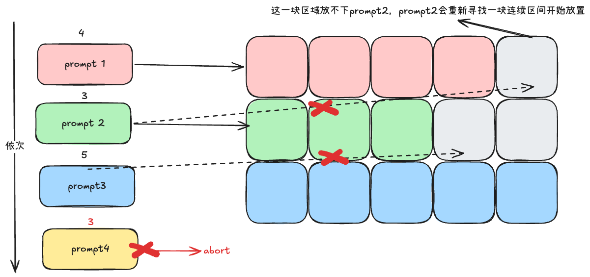

# KV Cache

KV Cache 是 llm serving中相当关键的一部分

> [!important] \
> 需要理解：\
> 什么是kv cache \
> 然后如何管理kv cache \
> kv cache 优化

# 什么是KV Cache & 瓶颈分析

作答思路: 定义，为什么存在

## KV Cache是什么

定义：KV Cache 是指大模型推理时，把 Transformer 每一层 Attention 中已经计算好的 Key 和 Value 向量缓存下来。

为什么：

大模型计算过程中会计算一个注意力机制，通过输入依次计算query key value 三个矩阵

然而，decode过程是一个自回归过程，每次需要对历史 token 做 Attention。在这个过程中，多次的计算都属于重复。

有了 KV Cache，Prefill 阶段先算好并存入显存，Decode 阶段只计算新 token 的 Q/K/V，并拼接使用缓存，从而把 Decode 的注意力计算从 O(n²) 降到 O(n)，显著提升推理效率。代价是会占用一定显存，实际系统中通常会配合 PagedAttention 或 GQA 来优化。


## KV Cache 显存大小计算

b 为batch size，**<u> seq_len 为序列总长度（包括用户提供的提示词（prompt）以及模型生成的补全部分（completion））</u>**，n_layer 为解码器块/注意力层数，n_heads 为每个注意力层的注意力头数，d_head 为注意力层的隐藏维度，p_a 为精度对应比特数目。kv各一个所以需要乘以2。多头注意力（MHA）模型使用 KV 缓存技术，每个 token 的内存消耗量（以字节为单位）为：
$$
kv\_cache\_memory = 2 × b × seq\_len × (n_{layer} × n_{heads} × d_{head}× (p_a / 8))
$$
其中，

| 精度  | p_a  | 用途               |
| ----- | ---- | ------------------ |
| INT 8 | 8    | 权重量化，kv cache |
| INT 4 | 4    | 超低精度量化       |
| FP 8  | 8    | 混合精度训练       |
| FP 16 | 16   | 推理               |
| FP 32 | 32   | 训练高精度推理     |
| BF 16 | 16   | 训练，推理         |
|       |      |                    |

==**kv cache 节约计算量计算模拟**==

```
假设这一次的输入文本长度为n=1000
# 在不使用kv cache的情况下
第一次 计算 key value 1000*2 key一次 vakue一次
。。。。
需要计算1000次  
所需计算量为key value 1000*3

# 在使用kv cache的情况下
第一次计算 需要计算key value 1000*2
之后都是1次
因此
所需计算量1000*2

```

从以上数据可以看出，**KV 缓存内存消耗可能会变得非常大，甚至超过了加载大型序列模型权重所需的内存量。**

#  单机内存管理KV Cache 的管理策略

> [!IMPORTANT]
>
> 目标：解决“存哪里、怎么存、存不下怎么办”的问题。

## 传统显存管理

KV Cache 是指大模型推理时，把 Transformer 每一层 Attention 中已经计算好的 Key 和 Value 向量缓存下来。通常我们会将其放置在gpu的HBM中，但是这里的大小有限。这时候就需要我们更好的利用整体的空间大小

> 模型中不是每一层都是attention操作啊，query，MLP 中间状态，LayerNorm / Activation 状态

最初，HBM分配是seq到来找到一块连续的空闲空间，这会造成大量的内存碎片。



## PagedAttention 详解：操作系统思想在显存管理中的应用

这意味着：

- ✅ 用 **指针 + offset**
- ✅ 假设内存是 **一整块连续 buffer**
- ✅ kernel 内部不做复杂的索引/跳转

👉 一旦变成非连续：

- kernel 要维护 **block index**
- cache 命中模式被打乱
- 性能急剧下降

```python
# kv_cache 申请
kv_cache = malloc(seq_len * layer * head * dim * sizeof(dtype));
# 直接去寻址
for i in (0, seq_len):
    attention(kv_cache[i])
```

## KV Cache 生命周期：分配、追加、释放与抢占（Preemption）


# 减少 KV Cache 显存开销的的优化技术 


# 相关学习资料

https://github.com/ForceInjection/AI-fundamentals/blob/main/09_inference_system/kv_cache/README.md
