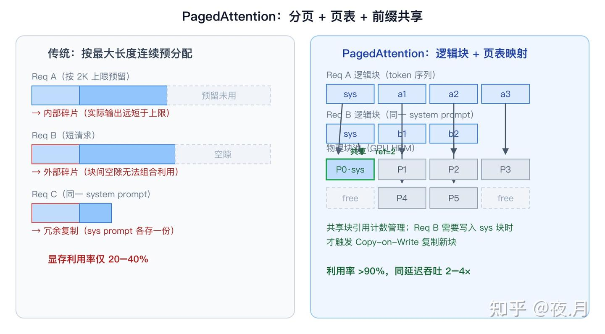
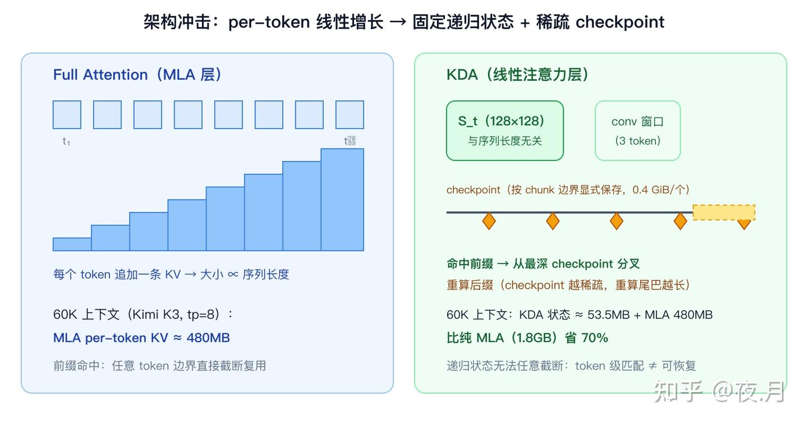

# KV Cache

KV Cache 是 llm serving中相当关键的一部分

> [!important] \
> 需要理解：\
> 什么是kv cache \
> kv cache 优化
> 然后如何管理kv cache 

# 什么是KV Cache & 瓶颈分析

作答思路: 定义，为什么存在

## KV Cache是什么

定义：KV Cache 是指大模型推理时，把 Transformer 每一层 Attention 中已经计算好的 Key 和 Value 向量缓存下来。

为什么：

大模型计算过程中会计算一个注意力机制，通过输入依次计算query key value 三个矩阵

然而，decode过程是一个自回归过程，每次需要对历史 token 做 Attention。在这个过程中，多次的计算都属于重复。

有了 KV Cache，Prefill 阶段先算好并存入显存，Decode 阶段只计算新 token 的 Q/K/V，并拼接使用缓存，从而把 Decode 的注意力计算从 O(n²) 降到 O(n)，显著提升推理效率。代价是会占用一定显存，实际系统中通常会配合 PagedAttention 或 GQA 来优化。


## KV Cache 显存大小计算

b 为batch size，**<u> seq_len 为序列总长度（包括用户提供的提示词（prompt）以及模型生成的补全部分（completion））</u>**，n_layer 为解码器块/注意力层数，n_heads 为每个注意力层的注意力头数，d_head 为注意力层的隐藏维度，p_a 为精度对应比特数目。kv各一个所以需要乘以2。多头注意力（MHA）模型使用 KV 缓存技术，每个 token 的内存消耗量（以字节为单位）为：
$$
kv\_cache\_memory = 2 × b × seq\_len × (n_{layer} × n_{heads} × d_{head}× (p_a / 8))
$$
其中，

| 精度  | p_a  | 用途               |
| ----- | ---- | ------------------ |
| INT 8 | 8    | 权重量化，kv cache |
| INT 4 | 4    | 超低精度量化       |
| FP 8  | 8    | 混合精度训练       |
| FP 16 | 16   | 推理               |
| FP 32 | 32   | 训练高精度推理     |
| BF 16 | 16   | 训练，推理         |
|       |      |                    |

==**kv cache 节约计算量计算模拟**==

```
假设这一次的输入文本长度为n=1000
# 在不使用kv cache的情况下
第一次 计算 key value 1000*2 key一次 vakue一次
。。。。
需要计算1000次  
所需计算量为key value 1000*3

# 在使用kv cache的情况下
第一次计算 需要计算key value 1000*2
之后都是1次
因此
所需计算量1000*2

```

从以上数据可以看出，**KV 缓存内存消耗可能会变得非常大，甚至超过了加载大型序列模型权重所需的内存量。**

如{@fig:HBM_use}所示，是GPU的显存使用情况,模型权重和kv缓存是两个最大的开销：
{#fig:HBM_use}

%%r:所以，降低 kv cache 显存占用有以下几个解决方案：
1. 降低kv cache自身显存占用 —— kv cache量化、分布式kv cache存储、MQA/GQA等结构层面减少KV头数；
2. 优化系统管理方案，更高效地利用有限显存 —— PagedAttention减少碎片、KV Eviction驱逐不重要token、Prefix Caching复用相同前缀；
3. 减少需要缓存的token总量 —— 滑动窗口注意力只保留近期token、投机解码减少decode步数。%%

# KV Cache 量化

> [!Note]
>
> 目标：解决kv cache每一个token大小的问题，减少他在显存中的占用。

将 FP16 / BF16 等高精度的 Key 和 Value 缓存映射为 FP8、INT8、INT4 甚至 INT2 等低精度表示，从而成倍降低显存占用并减少访存带宽压力。

%%r:量化的核心思路：在可接受精度损失的范围，用更紧凑的数据格式来表示原始数据，也就是将浮点数映射到整数里面%%

## 量化数学原理

```text
//量化映射，有点类似预测未防止极端数据，会进行一定的缩放
scale = (max_val-min_val)/(2^bits - 1)
zero_point = round(-min_val/scale)
q = clamp(round(x/scale+zero_point),0,2^bits-1)

//反量化
x' = (q - zero_point)*scale

//scale:比例因子，决定量化精度
// Zero-point：零点，处理非对称范围
// Bit-width：位宽，决定熟知范围
```

ok，那根据这个数学原理，我们知道需要知道 max_val 和 min_val, 跟预测问题一样，我要么根据历史数据得知，但是这会有数据便宜，要么实时计算，这样量化又可以分为动态量化和静态量化


#  引擎里的 KV 存储技术

> [!Note]
>
> 目标：解决“存哪里、怎么存、存不下怎么办”的问题。

## 传统显存管理

KV Cache 是指大模型推理时，把 Transformer 每一层 Attention 中已经计算好的 Key 和 Value 向量缓存下来。通常我们会将其放置在gpu的HBM中，但是这里的大小有限。这时候就需要我们更好的利用整体的空间大小

> 模型中不是每一层都是attention操作啊，query，MLP 中间状态，LayerNorm / Activation 状态

最初，HBM分配是seq到来找到一块%%b:连续的空闲空间%%，这会造成大量的内存碎片。


## PagedAttention --vllm

PagedAttention（SOSP 2023）借鉴操作系统虚拟内存分页管理 KV Cache，解决传统方案的三大内存浪费：

- 内部碎片：按”最大可能序列长度”预分配连续内存，实际输出远短于上限；
- 外部碎片：请求长度各异，内存块之间产生无法组合的空隙；
- 冗余复制：并行采样、beam search 下多条序列共享相同前缀却各存一份。

核心设计：把逻辑连续的 KV Cache 切成固定大小的块（block），通过页表做逻辑到物理的映射，KV Cache 在物理显存中可以非连续存储。调度器每步显式分配/回收块；不同请求共享相同前缀（如 system prompt）时，前缀页指向同一物理块，用引用计数管理生命周期，写入时才触发 Copy-on-Write。显存利用率从 20%–40% 提升到 >90%，同延迟下吞吐提升 2–4×。

代价：注意力 kernel 必须感知分页（block table 间接寻址），编程复杂且有 kernel 性能损失
> 如何理解：



%%r:vLLM V1 的完整链路：%%调度器维护三队列（WAITING → RUNNING → SWAPPED）。显存不足时触发抢占，两种策略——RECOMPUTE（释放全部 KV 块、下次重算）与 SWAP（KV 从 GPU 换出到 CPU、之后换回），这是引擎级 GPU↔CPU 分层存储的实现。执行层的 blocks_to_swap_in/out/copy 在 forward 前完成，其中 blocks_to_copy 正是 prefix cache 命中后共享块的写时复制路径。V1 还集成了 Automatic Prefix Caching（APC）——基于 token 块哈希的前缀复用。

> [!important]
> 补充代码
```python
# kv_cache 申请
kv_cache = malloc(seq_len * layer * head * dim * sizeof(dtype));
# 直接去寻址
for i in (0, seq_len):
    attention(kv_cache[i])
```

## RadixAttention --SGlang

RadixAttention（2023）的核心目标是跨请求的自动 KV 复用，数据结构是基数树（Radix Tree）：

- 树的每条边标记一段 token 序列，节点持有 KV pool 的 slot 索引；
- 新请求到来时做最长前缀匹配：命中部分直接复用其 KV，未命中部分追加为新节点；
- LRU 等策略淘汰旧节点释放显存。


%%r:实现细节（sglang mem_cache/，main 分支）——三个设计值得注意：%%

1. 树只存索引、不存张量：TreeNode.value 指向 KV pool 的 slot 索引，与 PagedAllocator（页粒度分配/回收）咬合；命中前缀时 value 就是可直接喂给 attention backend 的物理位置。insert 只登记索引不分配 slot，cache_finished_req 在请求完成时插树并去重释放已被树覆盖的前缀 slot。
2. 锁沿父链传播：只要某请求持有叶子节点的 lock（lock_ref），整条前缀链都不可淘汰；evict 从增量维护的 evictable_leaves 集合按策略建堆逐个释放，复杂度与淘汰量成正比而非树大小。淘汰策略有 7 种（LRU/LFU/FIFO/MRU/FILO/priority/SLRU），默认 LRU。
3. 统一锚点贯穿多层存储：TreeNode 同时持有 value（GPU slot 索引）、host_value（CPU slot 索引）、hash_value（每页一个哈希，作外部存储 key）——一棵树天然索引三层存储，是后文 HiCache 的基础。
extra_key（LoRA id / cache salt）进入键空间实现命名空间隔离；树只在 page 边界分裂节点，page 对齐贯穿全栈。

缺点：CPU 侧树操作开销随命中率上升；收益依赖负载的前缀分布，低命中负载反受其累

> [!important]
> 补充代码

```python

```

##vAttention：把分页做进 MMU
PagedAttention 把虚拟内存布局从连续变为非连续，代价是注意力 kernel 必须感知分页（block table 间接寻址），编程复杂且损失 kernel 性能。vAttention（Microsoft，arXiv 2405.04437）走另一条路：用 CUDA Virtual Memory Management API 解耦虚拟/物理内存分配——虚拟地址空间预先分配连续大块，物理显存按需映射。物理层碎片通过延迟映射解决，而虚拟连续性保留：原生兼容未改造的注意力 kernel（FlashAttention 等），吞吐比 PagedAttention kernel 最高 1.23×。

两条路线的对比本质是：PagedAttention 把分页做进 kernel，vAttention 把分页做进 MMU。后者依赖 CUDA VM API 且物理碎片仅缓解不消除，但思路代表了”OS 虚拟内存思想进一步下沉”。

## 架构演进对 KV 存储的冲击：MLA 与 KDA
MLA（DeepSeek）：把多头 K/V 压缩为低秩 latent 向量c_KV ，只缓存 latent、推理时解压。%%r:DeepSeek-V3 的 KV 维度从 GQA 的 2048 降到 576，压缩约 3.6×%%。==代价是 TP 切分困难：每个设备都需加载完整 latent，内存优势被并行度抵消==
> 如何解读：
> 
TPLA（ASPLOS 2026）用 Hadamard/PCA 重参数化使 latent 可沿特征轴切分，免训练加载 MLA checkpoint，32K 上下文加速 1.79×/1.93×。

KDA（Kimi K3）打破 per-token 假设：K3（2.8T 参数、1M 上下文）的注意力骨架是”三 KDA + 一 MLA”交替（93 层中 69 层 KDA）。%%r:KDA 不存逐 token KV%%，历史递归压缩为固定大小的 Recurrent State（$S_t \in \mathbb{R}^{128 \times 128}$与序列长度无关）+ 卷积窗口，KV Cache 降低约 75%。但这根本改变了缓存性质：

- 递归状态无法任意截断回退——token 级前缀匹配成功 ≠ 状态可恢复，必须在选定前缀边界显式存 checkpoint；
- 单个 KDA checkpoint ≈ 0.4 GiB；128 token 间隔下 1M 上下文需 ~3TB，10K 间隔也要 ~40GB——checkpoint 越稀疏，命中后重算的后缀越长；
- MLA KV 与 KDA State 必须在同一前缀边界对齐。


> Full Attention 的 KV 随序列线性增长、可任意截断复用；KDA 只存固定状态 + 稀疏 checkpoint，命中需从最近 checkpoint 分叉并重算后缀
---
%%r:SGLang 的解法（MambaRadixCache）%%：树节点同时持有 value（MLA per-token KV 索引）和 mamba_value（KDA per-prefix 状态 slot），两套独立 LRU/引用计数；节点分裂时 mamba_value = None（状态无子结构可切）。关键机制：track/donate/branching 闭环（递推中定期快照状态 → 零拷贝”过户”给基数树 → 命中时从最深状态节点分叉重算尾巴）、ping-pong track buffer（2 个 track slot 交替写/取，给 donate 2 轮 chunk 余量，是 overlap 调度的前提）、INT8 冷池（per-(head,k-channel) 对称量化，同显存缓存约 4× 前缀状态）。实测 60K 上下文下 KDA 混合 cache 比纯 MLA 省 70%。vLLM 社区（K3 团队贡献）则用三粒度解耦：hash 粒度（前缀匹配探测）× 物理状态块（摊销存储）× 调度对齐粒度，4,096-token 的物理块内部可在任意位置记录命中点直接恢复。TokenSpeed 的 Flat KV 更进一步：一页既可存 1,536 token 的 MLA latent，也可存一个完整 KDA 快照——统一页分配器与地址空间，prefix cache / CoW / PD 传输协议全部复用。

# Attention Store系统
单卡 HBM 装不下 KV Cache 时，就需要把它扩展到 CPU DRAM、SSD 和分布式存储——这类系统统称 Attention Store。核心思想是“以存换算”：用更多的存储资源换取更少的计算。


# 常用模型kv cache 计算
## glm53 计算

## DeepSeek-V4-Pro

第一步：每层存什么。 V4-Pro 有 61 层注意力，每层 = 一个局部滑窗（SWA）分支 + 一个全局压缩分支；全局分支按压缩比分两种——30 层 CSA（压缩比 4，记 C4）+ 31 层 HCA（压缩比 128，记 C128），30 个 C4 层还各带一个 lightning indexer。落到显存上是 7 个 cache pool，”单 slot”一列是该 pool 的一条条目跨全部层的字节数：

| Cache Pool | dtype | 条目宽 | 层数 | 单 slot |
|:---|:---|:---|:---|:---|
| SWA-KV-Cache | uint8（1B） | 584 | 61（MTP 态 62） | 35,624 / 36,208 B |
| C128-Cache | uint8（1B） | 584 | 31 | 18,104 B |
| C4-Cache | uint8（1B） | 584 | 30 | 17,520 B |
| C4-index-Cache | uint8（1B） | 132 | 30 | 3,960 B |
| C128-State | FP32（4B） | 512 × 2 | 31 | 126,976 B |
| C4-State | FP32（4B） | 512 × 2 × 2 | 30 | 245,760 B |
| C4-index-State | FP32（4B） | 128 × 2 × 2 | 30 | 61,440 B |

第二步：固定存储项。 固定项只由两件事构成——滑窗内驻留的 SWA KV，以及三个 State 环形缓冲。环深分别是 window_size = 128、C4_ring_size = 8、C128_ring_size = 128：

KV_fixed = SWA_slot × window_size
         + (C4_State_slot + C4_index_State_slot) × C4_ring_size
         + C128_State_slot × C128_ring_size

         = 35,624 × 128  +  (245,760 + 61,440) × 8  +  126,976 × 128
         = 4,559,872     +  2,457,600               +  16,252,928
         = 23,270,400 B  ≈ 22.2 MiB（文档记作 22.2MB）
拆占比：C128-State 环 15.5 MiB（70%）、SWA 滑窗 4.35 MiB（20%）、C4 两个 State 环 2.34 MiB（10%）。这里藏着一个反直觉的事实：C128-State 环（15.5 MiB）比它服务的 C128 压缩 KV 本身还大——100K 上下文下 C128-Cache 全长只有 13.8 MiB（交叉点约在 11.5 万 token）。固定开销的大头不是”要缓存的历史”，而是”维护压缩状态所需的无损缓冲”。

第三步：线性增长存储项。 7 个池里只有三个全局池随上下文增长，压缩比决定它们每多少 token 才落一条条目：

KV_linear = C128_slot × CTX/128 + (C4_slot + C4_index_slot) × CTX/4
          = 18,104 × CTX/128    + (17,520 + 3,960) × CTX/4
          = 141.4 × CTX         + 5,370 × CTX
          = 5,511 B / token     ≈ CTX × 5.4KB
两项相加，就是那条官方线性公式：


第四步：100K 上下文（102,400 token）一条请求的账。 固定项 22.2 MiB，线性项 538.2 MiB，合计 ≈560 MiB（≈587.6 MB）：

线性部分 538.2 MiB（564.4 MB = 102,400 × 5,511 B）
   C4-Cache：       17,520 B × 25,600（= CTX/4）  = 448.5 MB  （79.5%）
   C4-index-Cache：  3,960 B × 25,600             = 101.4 MB  （18.0%）
   C128-Cache：     18,104 B ×    800（= CTX/128）=  14.5 MB  （ 2.6%）
固定部分 22.2 MiB（23,270,400 B）
   SWA 滑窗 128 token × 35,624 B                  =   4.35 MiB
   C4 + C4-index State 环 8 槽                    =   2.34 MiB
   C128 State 环 128 槽                           =  15.50 MiB
合计 ≈ 560 MiB / 请求

# 相关学习资料

https://github.com/ForceInjection/AI-fundamentals/blob/main/09_inference_system/kv_cache/README.md

https://zhuanlan.zhihu.com/p/2082615179595073265
