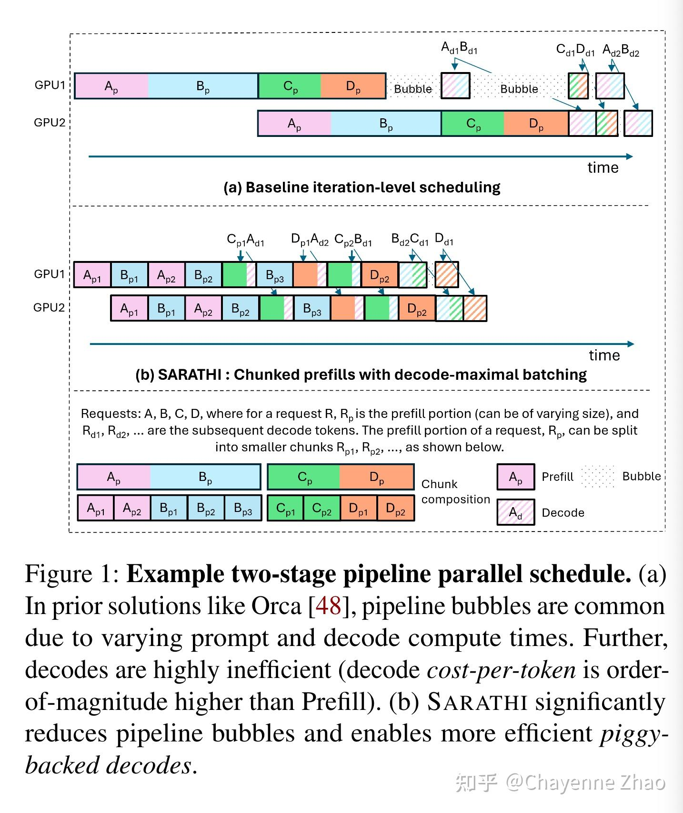
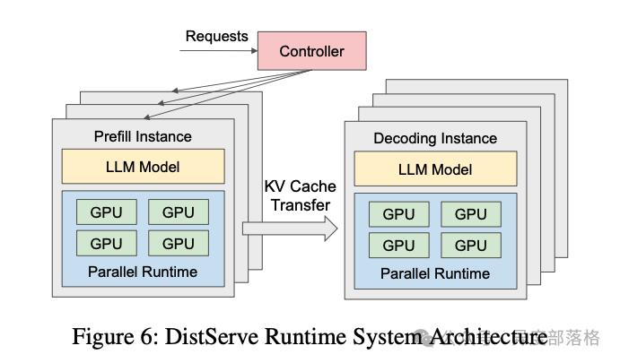
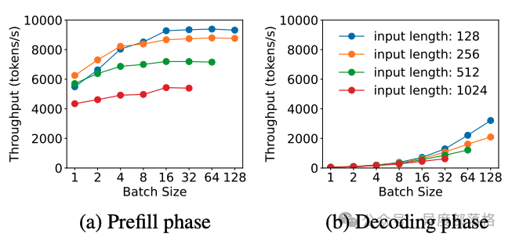
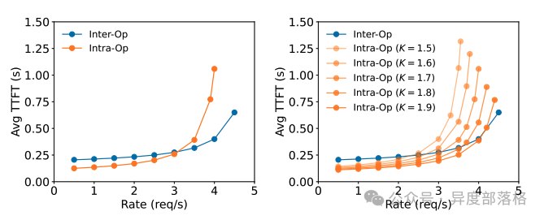
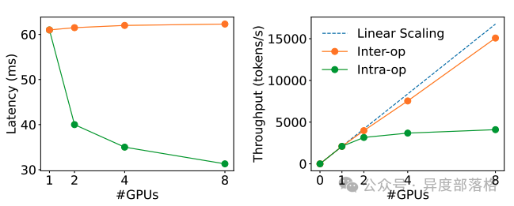

# pd 相互干扰: prefill 与 decode 的调度博弈

在 LLM 推理服务中,prefill(处理初始 prompt)和 decode(逐 token 生成)是两个计算特性截然不同的阶段。如何在调度上让两者不互相拖累,是推理框架的核心问题之一。

## 基础概念:prefill 与 decode 阶段

- **prefill 阶段**：处理模型的初始 prompt,生成初始的 hidden states,涉及一次 forward。计算密集型。
- **decode 阶段**：根据 hidden states 逐步生成后续文本,只计算最新 token 的激活值,计算量相对较小,显存带宽密集型。

# 请求粒度的优化

## 场景一:多个请求同时到达 -> 凑成一批一起算(静态批量处理)

### 场景描述

多个用户的推理请求在同一时刻到达,把它们凑成一个 batch,统一做一次 prefill,再统一推进 decode。

### 方案:静态批量处理(Static Batching)

将同时到达的所有推理请求组成一个批次,一次性进行预填充计算。

- 优点:能有效利用 GPU 的并行计算资源,提高整体吞吐量。
- 缺点:处理时间短的请求需要等待批次中最慢的请求完成,存在短板效应,增加延迟。

### 时序示例

```
Static Batching(E 倒霉):
step0: prefill [A,B,C,D]                    <- E 在队列等
step1: decode   [A,B,C,D]
step2: decode   [A空转,B,C,D]               <- A完成了但占着位,E还在等
step3: decode   [A空转,B空转,C,D]
step4: decode   [A空转,B空转,C空转,D]
step5: decode   [A空转,B空转,C空转,D]        <- E 等了5个step还没轮到
step6: D完成 -> 整批释放
step7: 才开始给 E 做 prefill                <- E 白等了 6 个 step
```

### 局限

1. **短板效应**:batch 内早完成的请求占位空转,等最慢那个完成才整批释放。
2. **新请求无法插队**:中途到达的请求即使 batch 里有空位(别人空转),也必须等整批释放才能开始。

> 对应 demo:`demos/static_batching.py`,可运行查看这两个局限的量化表现。

---

## 场景二:请求动态到达、有进有出 -> 随到随插(连续批量处理)

### 场景描述

请求随时间动态到达,batch 中途既有请求完成、也有新请求插入。

### 方案:连续批量处理(Continuous Batching)

也称为动态批量处理,在推理的**迭代层面**(每个 decode step)进行批次管理。continuous 优化的是"动态进出、不让空转请求占位、新请求随时插队"。

<u>**当批次中某个请求完成后,可以立即用新请求替换它,无需等待整个批次完成。**</u>

- 优点:更有效地利用 GPU 资源,减少空闲时间,降低平均延迟。

### 时序示例

```
Continuous Batching(E 立刻用上):
step0: prefill [A,B,C,D]                    <- E 在队列等
step1: decode   [A,B,C,D]
step2: decode   [B,C,D] + E插队prefill完 -> [B,C,D,E]   <- A完成立刻释放,E立刻顶上
step3: decode   [C,D,E] + F插队 -> [C,D,E,F]            <- B完成腾位,F顶上
step4: decode   [D,E,F,G]                               <- C完成,G顶上
...
全程不空转,新请求几乎不等
```

### 局限:仍未解决 prefill 与 decode 在计算层面的并行

continuous batching 细化的是"调度粒度"(请求何时进出 batch),但并没有改变 prefill 与 decode 在计算上仍串行的事实。当一个新请求插入 batch 时,需要先完成它的 prefill;而 prefill 是计算密集型,会吃满 GPU,这期间正在 decode 的 batch 必须暂停,等 prefill 算完才能继续。

也就是说,continuous batching 解决了"请求级"的动态进出,**却没解决"计算级"的 pd 阻塞--长 prefill 依然会打断 decode**。这正是 chunked prefill 要补上的最后一块。

## 场景三:长 prefill 打断 decode -> prefill 与 decode 同 batch 并行(chunked prefill)

### 场景描述

假设最开始有 A、B 两个序列,它们都处于 decode 阶段。在 A 和 B 完成 1 次 decode 之后,来了 C、D 两个新请求。

### 问题:为什么会产生 pd 相互干扰

vLLM 默认是 **prefill 优先(prefill-first)** 的调度策略:新请求的 prefill 优先级高于正在进行的 decode。所以它会先处理 C、D 的 prefill,使 A、B 的 decode 被迫暂停;等 C、D 的 prefill 完成后,A、B、C、D 再同时做 decode。

### 后果

A 和 B 的第 1 次 decode 与第 2 次 decode 之间的间隔被拉长,导致 A、B 用户的等待变久(ITL,单 token 间延迟升高)。

> **根本原因**:传统调度是"非 prefill 即 decode",prefill 优先级又高于 decode,导致一个长的 prefill 会阻塞所有正在 decode 的请求,造成大量请求等待。

### chunked prefill

v1.0(静态)和 v2.0(连续)虽然提升了吞吐,但都没有解决"prefill 阻塞 decode"这个根本问题。chunked prefill 正是为此而生:

- **核心思想**:让 prefill 和 decode 能同时放在一个 batch 里做推理,而不是"非 prefill 即 decode"的二选一。
- **对长请求的处理**:对于比较长的请求序列,它的 prefill 无法在一个 batch 里执行完,会做 [chunk](https://so.csdn.net/so/search?q=chunk&spm=1001.2101.3001.7020) 切割,分在多个 batch 里完成。所以叫做 chunked-prefill。

prefill 不再独占调度打断 decode,两者可以在同一个 batch 中并行推进,从而消除上面提到的 pd 相互干扰问题。




-----

在大模型推理中，常用以下两项指标评估性能：

- [TTFT](https://zhida.zhihu.com/search?content_id=250909492&content_type=Article&match_order=1&q=TTFT&zhida_source=entity)（Time-To-First-Token）：首 token 的生成时间，主要衡量 Prefill 阶段性能。
- [TPOT](https://zhida.zhihu.com/search?content_id=250909492&content_type=Article&match_order=1&q=TPOT&zhida_source=entity)（Time-Per-Output-Token）：生成每个 token 的时间，主要衡量 Decode 阶段性能。

当 Prefill 和 Decode 在同一块 GPU 上运行时，由于两阶段的计算特性差异（Prefill 是计算密集型，而 Decode 是存储密集型），资源争抢会导致 TTFT 和 TPOT 之间的权衡。例如：

- 若优先处理 Prefill 阶段以降低 TTFT，Decode 阶段的性能（TPOT）可能下降。
- 若尽量提升 TPOT，则会增加 Prefill 请求的等待时间，导致 TTFT 上升。

PD 分离式架构的提出正是为了打破这一矛盾。通过将 Prefill 和 Decode 分离运行，可以针对不同阶段的特性独立优化资源分配，从而在降低首 token 延迟的同时提高整体吞吐量。


# 架构优化

## 什么是 [Prefill-Decode 分离](https://zhida.zhihu.com/search?content_id=250909492&content_type=Article&match_order=1&q=Prefill-Decode+分离&zhida_source=entity)？

在传统的 LLM 推理框架中，Prefill 和 Decode 阶段通常由同一块 GPU 执行。推理引擎的调度器会根据显存使用情况及请求队列状态，在 Prefill 和 Decode 之间切换，完成整个推理过程。

而在 Prefill-Decode 分离式架构（以下简称 PD [分离式架构](https://zhida.zhihu.com/search?content_id=250909492&content_type=Article&match_order=2&q=分离式架构&zhida_source=entity)）中，这两个阶段被拆分到不同的 GPU 实例上独立运行。如下图所示，这是 DistServe 提供的一张架构图：



在 PD 分离式架构中：

- Prefill Instance 专注于 Prefill 阶段的计算。
- Decode Instance 专注于 Decode 阶段的生成任务。

当 Prefill Instance 完成 KV Cache 的计算后，会将其传输给 Decode Instance，后者接续生成结果。这种架构独立优化了两个阶段的性能，因此又被简称为 PD 分离。


## 分离式推理架构的优化方向

### 1. 算力与存储的独立优化

在 [PD 分离架构](https://zhida.zhihu.com/search?content_id=250909492&content_type=Article&match_order=1&q=PD+分离架构&zhida_source=entity)中，Prefill 和 Decode 阶段的资源需求不同，分别体现为：

- Prefill 阶段：计算密集型（[compute-bound](https://zhida.zhihu.com/search?content_id=250909492&content_type=Article&match_order=1&q=compute-bound&zhida_source=entity)）。在流量较大或用户提示长度较长时，Prefill 的计算压力更大。完成 KV Cache 的生成后，Prefill 阶段本身无需继续保留这些缓存。
- Decode 阶段：存储密集型（[memory-bound](https://zhida.zhihu.com/search?content_id=250909492&content_type=Article&match_order=1&q=memory-bound&zhida_source=entity)）。由于逐 token 生成的特性，Decode 阶段需频繁访问 KV Cache，因此需要尽可能多地保留缓存数据以保障推理效率。

因此，在 PD 分离架构下，可以分别针对计算和存储瓶颈进行优化。

### 2. [Batching 策略](https://zhida.zhihu.com/search?content_id=250909492&content_type=Article&match_order=1&q=Batching+策略&zhida_source=entity)的独立优化

在 DistServe 的实验中，Batching 策略对两阶段的性能影响显著，但趋势相反：

- Prefill 阶段：吞吐量随 batch size 增加逐渐趋于平稳。这是因为 Prefill 的计算受限特性（compute-bound），当 batch 中的总 token 数超过某个阈值时，计算资源成为瓶颈。
- Decode 阶段：吞吐量随 batch size 增加显著提升。由于 Decode 阶段的存储受限特性（memory-bound），增大 batch size 可提高计算效率，从而显著增加吞吐量。

下图展示了两阶段吞吐量随 batch size 变化的趋势：





### 3. 并行策略优化

在 PD 合并架构中，Prefill 和 Decode 阶段共享相同的并行策略（如数据并行 DP、[张量并行](https://zhida.zhihu.com/search?content_id=250909492&content_type=Article&match_order=1&q=张量并行&zhida_source=entity) TP 或[流水线并行](https://zhida.zhihu.com/search?content_id=250909492&content_type=Article&match_order=1&q=流水线并行&zhida_source=entity) PP）。但在 PD 分离架构中，可分别为两个阶段选择最优的并行策略。

DistServe 的实验结果显示：

- Prefill 阶段：
- 在请求率较小时，更适合张量并行（TP）。
- 在请求率较大时，更适合流水线并行（PP）。
- Decode 阶段：
- GPU 数量增加时，PP 可显著提高吞吐量（因为其处理方式是流水线化的）。
- TP 则可降低延迟（减少单个请求的处理时间）。

下图为不同并行策略下的性能对比：







## 相关论文

1. DistServe: Disaggregating Prefill and Decode for Goodput-optimized Large Language Model Serving

这篇论文提出了 DistServe 系统，通过将[大型语言模型（LLM）](https://zhida.zhihu.com/search?content_id=250909492&content_type=Article&match_order=1&q=大型语言模型（LLM）&zhida_source=entity)的预填充（prefill）和解码（decode）阶段分离，以优化服务性能。传统的 LLM 服务通常将这两个阶段合并处理，可能导致资源竞争和性能下降。DistServe 通过将预填充和解码分配到不同的 GPU 上，消除了相互干扰，并针对每个阶段的特定需求进行资源分配和并行策略优化，从而提高了每个 GPU 的有效吞吐量。

2. [Splitwise](https://zhida.zhihu.com/search?content_id=250909492&content_type=Article&match_order=1&q=Splitwise&zhida_source=entity): Efficient Generative LLM Inference Using Phase Splitting

该论文介绍了 Splitwise 技术，通过将 LLM 推理过程中的提示计算（prompt computation）和[令牌](https://zhida.zhihu.com/search?content_id=250909492&content_type=Article&match_order=1&q=令牌&zhida_source=entity)生成（token generation）阶段分离到不同的机器上，以提高硬件利用率。提示计算阶段计算密集，而令牌生成阶段则受限于内存带宽。通过分离这两个阶段，Splitwise 能够针对每个阶段的特定需求进行资源管理，从而在相同的成本和功耗预算下，实现更高的吞吐量。

3. Inference without Interference: Disaggregate LLM Inference for Mixed Downstream Workloads

这篇论文提出了 [TetriInfer](https://zhida.zhihu.com/search?content_id=250909492&content_type=Article&match_order=1&q=TetriInfer&zhida_source=entity) 系统，通过将 LLM 推理过程中的预填充和解码阶段分离，以减少不同下游任务之间的干扰。TetriInfer 通过将输入提示分割成固定大小的块、独立运行预填充和解码实例，以及使用智能的两级调度算法，显著降低了首次令牌生成时间（TTFT）和作业完成时间（JCT），并提高了性能与成本的效率。

4. MemServe: Context Caching for Disaggregated LLM Serving with Elastic Memory Pool

MemServe 系统针对分离式 LLM 服务中的上下文缓存管理问题，提出了[弹性内存池](https://zhida.zhihu.com/search?content_id=250909492&content_type=Article&match_order=1&q=弹性内存池&zhida_source=entity)的解决方案。通过高效的上下文缓存机制，MemServe 能够在不同的计算节点之间共享和管理内存资源，从而提高 LLM 服务的可扩展性和资源利用率。

5. Mooncake: A KVCache-centric Disaggregated [Architecture](https://zhida.zhihu.com/search?content_id=250909492&content_type=Article&match_order=1&q=Architecture&zhida_source=entity) for LLM Serving

Mooncake 提出了一种以键值缓存（KVCache）为中心的分离式 [LLM 服务架构](https://zhida.zhihu.com/search?content_id=250909492&content_type=Article&match_order=1&q=LLM+服务架构&zhida_source=entity)。通过优化 KVCache 的管理和传输，Mooncake 在满足服务水平目标（SLO）的前提下，实现了高达 525%的吞吐量提升。在实际工作负载下，Mooncake 使得 Kimi 系统的请求处理能力提高了 75%。

缺一篇综述论文
