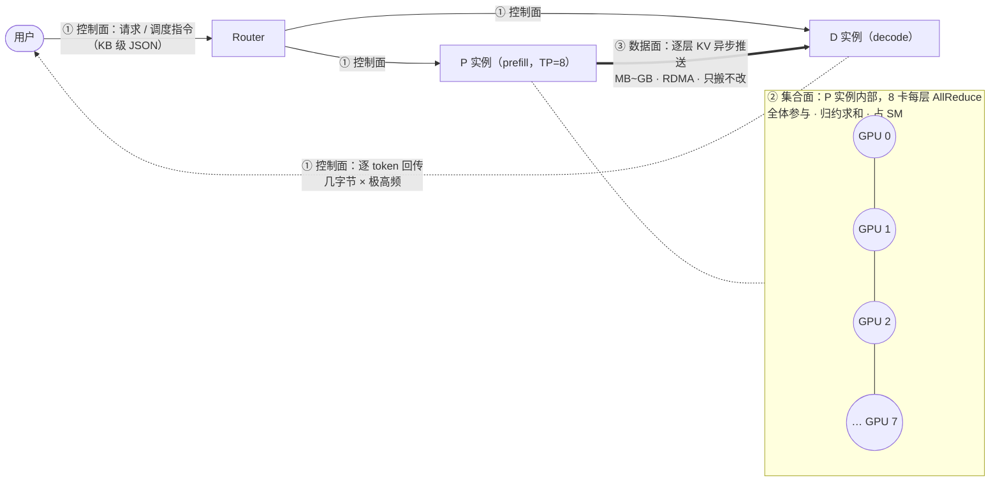
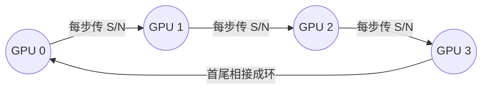

# 集群通信

推理引擎的集群里，其实同时跑着**三条完全独立的通信链路**。按**数据多大、谁在参与、能不能等**来划分，它们的诉求、协议、优化手段几乎没有交集：

| 链路                                 | 传输内容                         | 特征                                    | 典型技术                        | 优化目标             |
| ------------------------------------ | -------------------------------- | --------------------------------------- | ------------------------------- | -------------------- |
| **控制面**（Router/EngineCore↔Worker） | 请求元数据、调度指令、token 输出 | 小消息（字节~KB）、高频、必须可靠          | ZMQ / gRPC / HTTP / Ray actor   | 不阻塞主循环、低抖动 |
| **数据面**（P↔D）                    | KV Cache 张量                    | 大块（MB~GB）、一次性、单向、可容忍重传 | RDMA / NIXL / Mooncake / NVLink | 带宽打满、隐藏延迟   |
| **集合通信面**（全体 rank）          | TP 的 AllReduce、EP 的 AllToAll  | 中等块（KB~百 MB）、同步、严格多对多    | NCCL / HCCL / RCCL              | 延迟最小化、不抢 SM  |

控制面走 TCP 图的是"可靠"，数据面走 RDMA 图的是"绕开 CPU"，集合面走 NCCL 图的是"同步语义"。

一句话总纲：**控制面是"传话"，数据面是"搬运"，集合通信是"分布式算子"。**

## 读前扫盲：高频黑话速查

| 术语 | 人话解释 |
| ---- | -------- |
| **rank** | 参与通信的一个进程，通常一张 GPU 对应一个 rank |
| **P / D 实例** | P＝Prefill（负责算 prompt），D＝Decode（负责逐 token 生成），PD 分离部署的两类角色 |
| **SM** | GPU 的"CPU 核"（Streaming Multiprocessor）。说"占 SM"就是"占 GPU 算力" |
| **DMA / RDMA** | DMA：硬件自己搬数据、不占 CPU；RDMA：远程版 DMA，绕过两端 CPU 直接读写对端内存/显存 |
| **QP** | Queue Pair，RDMA 的"连接句柄"，使用前要先注册内存、建好 QP（所以小消息用它不划算） |
| **AllReduce** | 多卡数据归约（如逐元素求和）后，每卡都拿到一份完整结果 |
| **RS / AG** | ReduceScatter（归约后按卡切片分发）/ AllGather（各卡分片拼成完整张量） |
| **栅栏（Barrier）** | 全体到齐才能继续，最慢的人拖住所有人 |
| **TPOT / ITL** | decode 的延迟指标：每个输出 token 的耗时 / 相邻两个 token 之间的间隔 |
| **busbw** | 集合通信的带宽利用率指标（"互连实际被吃掉多少"），详见 Ring AllReduce 一节 |
| **P2P** | 有两个意思：① point-to-point（点对点传输）；② peer-to-peer（卡间直访显存）。按语境区分，别和 P↔D（Prefill/Decode）搞混 |

## 总览：一个请求的三种流量



图例：普通箭头＝控制面；粗箭头＝数据面（KV 搬运）；虚线箭头＝控制面的 token 回传流；虚线框＝P 实例内部的集合通信。

- ① **控制面**：Router 挑定 P、D 实例下发调度指令（KB 级 JSON）；D 侧逐 token 回传（每次几字节、极高频）。
- ② **集合面**（P 实例内部，TP=8）：每层算完，8 张卡把各自的 1/8 结果 AllReduce 归约——全体参与，算完才能进下一层。
- ③ **数据面**（P→D）：每层 KV 算完就异步推给 D——MB~GB，只有两方参与。

**注意 ② 和 ③**：同一时刻、同一个 P 实例内部跑着两种流量，性质却完全不同——这就是本章要分清的核心。

### 为什么必须分三条链路：属性不可调和

不是"人们选了三种方案"，而是三种流量的物理属性互相冲突，硬塞进一个方案必然两头不讨好：

| 矛盾               | 控制面                    | 数据面                     | 集合面                         |
| ------------------ | ------------------------- | -------------------------- | ------------------------------ |
| **参与方**         | 2 个（Router↔Worker）     | 2 个（P↔D）                | N 个（全体 rank）              |
| **量级**           | 字节~KB                   | MB~GB                      | KB~百 MB（decode 小、prefill 大） |
| **频率**           | 极高（每 token 一次）     | 低（每请求一次）           | 极高（每层一次）               |
| **能不能等**       | 不能等（吐 token 要实时） | **能等**（可以后台慢慢搬） | **不能等**（算完才能进下一层） |
| **数据要不要被改** | 不改                      | 不改，只搬                 | **要改**，要归约求和           |

教科书把三者统称"通信"，但它们物理上干的不是一回事。**总根因在最后一行"数据要不要被改"**：数据面只搬不改，所以可以纯 DMA、完全异步、失败重传；集合面要归约，所以必须全体同步、SM 参与计算、慢 rank 拖住全体。这也解释了三面的优化目标为何截然不同。

## 控制面通信

**负责进程 / 服务之间的管理与调度**，消息是 KB 级结构化数据（JSON / msgpack）。可以把它想象成"传令兵"：每条消息都很小，但一条都不能丢、还不能迟到。

### vLLM V1 进程模型

```
API Server 进程(s)  ──ZMQ + msgpack──>  EngineCore 进程  ──collective_rpc──>  GPU Worker 进程
 (tokenize/detokenize)                  (scheduler + KV mgr)                    (每 GPU 一个)
                                              │
                                    DP Coordinator（仅 DP>1 时才启动）
```

- 进程数公式：`A(API) + DP(EngineCore) + DP×TP×PP(Worker) +（仅 DP>1 时再 +1 个 DP Coordinator）`。一台 4 卡 `-tp=4`（DP=1）：1 + 1 + 4 = **6 个进程**；DP Coordinator 只在 DP>1 时存在（源码里直接 `assert dp_size > 1`），负责收集各副本负载、做全局调度。
- 序列化用 **msgspec / msgpack** 而非 pickle（类型安全 + 快 10–50 倍 + 无反序列化 RCE 风险；RCE＝远程代码执行——pickle 反序列化恶意数据可执行任意代码）；大张量（如多模态输入）走 `tensor_ipc.py` 的共享内存通道（API server → EngineCore），零拷贝、不过序列化。
- 多进程设计的两个动机，面试要能说出：**规避 GIL**（Python 同一进程同一时刻只有一个线程在执行，把引擎和前端拆开，事件循环才不会被 busy loop 卡住）+ **崩溃隔离**（CUDA fault 不拖垮前端，通过 `EngineDeadError` 上报）。

### SGLang 进程模型（对比着记）

```
HTTP Server ─┐
             ├─ TokenizerManager（主进程，ReqState 追踪）
             │        │ ZMQ PUSH
             │        ▼
             │    Scheduler（子进程，RadixCache + 组批 + event_loop_overlap）
             │        │ ZMQ PUSH
             │        ▼
             └─ DetokenizerManager（子进程，增量解码）
                      │ ZMQ PUSH 回 TokenizerManager
```

三段式流水，ZMQ PUSH 队列把各阶段解耦。消息结构统一定义在 `srt/managers/io_struct.py`，是系统的"通用语言"。

### 节点内进程间通信手段全景

同一台机器里，进程之间可选的"传话方式"从轻到重大致如下：

| 手段                               | 适用                | 说明                                                    |
| ---------------------------------- | ------------------- | ------------------------------------------------------- |
| **ZMQ (IPC transport)**            | 控制面              | 消息库，同机走 Unix domain socket，避开 TCP 栈开销，兼容 asyncio |
| **CUDA IPC**（`cudaIpcMemHandle`） | 同机跨进程 GPU 张量 | 直接映射对端进程显存，零拷贝；vLLM 的 Custom AllReduce 初始化就是用它互换各 rank 的 buffer 句柄 |
| **共享内存 / tensor_ipc**          | 同机大张量          | 零拷贝，需自行做同步（信号量/event）                    |
| **Unix socket / named pipe**       | 简单控制            | 轻量                                                    |
| **gRPC / HTTP**                    | 跨节点控制面        | Router ↔ worker、服务发现、健康检查                     |
| **etcd / NATS / Ray**              | 集群级协调          | 成员管理、角色注册、配置分发                            |

### 为什么控制面不走 RDMA / NCCL

- **不走 RDMA**：建链成本（注册内存、建 QP）远高于小消息本身收益——为发 100 字节去注册内存，得不偿失。
- **不走 NCCL**：NCCL 是集合语义，Router 和 Worker 之间根本不构成"通信域"。
- 控制面要的是**可靠投递、可观测、易调试**——TCP/gRPC 的生态（重试、超时、链路追踪、健康检查）才是刚需。分离三面的本质是**让每种流量走它最擅长的通道**。

## 数据面通信

**P→D 的 KV Cache 搬运，字节级 1:1 复制**——搬过去就完事，一个字节都不用改：

```
P 的显存: [K1 V1 K2 V2 ... Kn Vn]  ──搬运──>  D 的显存: [K1 V1 K2 V2 ... Kn Vn]
                                        内容完全一样，只是换了地方
```

正因为"只搬不改"，它可以：

- **纯 DMA**：网卡硬件直接读写显存，GPU 完全不参与，不占一个 SM
- **完全异步**：扔给网卡后 GPU 继续算下一层，传完通知一声即可
- **失败可容忍**：顶多这个请求回退重算，其他请求毫发无损

（PD 分离为什么值得做，见 `../prefill 与 Decode 调度/pd.md`；这里只关心 KV 怎么搬。）

### 传输量估算：先算清要搬多少字节

每个 token 的 KV Cache 大小（bf16 单副本）：

```
KV_bytes/token = 2(K和V) × n_layers × n_kv_heads × head_dim × dtype_bytes ÷ tp_size
```

以 Llama-3.1-70B（80 层，GQA 8 个 KV 头——多个 Q 头共享少量 KV 头，KV 才这么小，head_dim=128）为例：`2 × 80 × 8 × 128 × 2B = 320 KB/token`。

- 一个 8K prompt 的 KV ≈ **2.6 GB**；单张 400G 网卡（≈50 GB/s 单向）传完 ≈ **52 ms**；Mooncake 4×200G 实测 87 GB/s 也要 ≈ 30 ms。
- 这个量级划定了 PD 分离的收益边界：**调度上省下的干扰时间必须大于 KV 传输时间**，否则分离反而更慢。
- 数据面所有优化归为两条路：**少传**（prefix 复用、增量传输、FP8 KV 减半）或**传得快且藏进计算**（下面四条）。

### 传输怎么做才快（四个必答的优化）

1. **Layer-wise 流水传输**：每算完一层 attention，立刻异步发起该层 KV 的传输，与下一层计算重叠：

   ```
   计算：     [ L1 ][ L2 ][ L3 ][ L4 ][ L5 ]
   KV 传输：     [L1→D][L2→D][L3→D][L4→D]     ← 与计算重叠，末层算完时 KV 已到 D 大半
   ```

2. **Block 粒度 + 页对齐**：按 PagedAttention 的 block 传输，而非连续大 tensor。生产实践常把传输粒度从默认 16 提到 128/256 token——块太小则元数据开销和 RDMA 握手次数爆炸；块太大则凑不满一块也得等，流水线粒度变粗。
3. **Zero-copy / GPUDirect RDMA**：网卡 DMA 引擎直接读写 GPU 显存，绕开主机内存中转，端到端延迟再降约 40%。注意 RDMA 只能读写提前向网卡注册过的内存（CPU 内存要 pin 住，显存要走注册流程）。
4. **Prefix Reuse / 增量传输**：若 decode 侧或全局 Radix Tree 已有部分 prefix，prefill 只算未命中的 delta token，只传增量。**传输量骤降，这是比"传得更快"高一个维度的优化。**

## 集合通信面

与数据面的"纯搬运"不同，集合通信是**分布式算子**：数据要被归约、重排，由 SM 上的 kernel 驱动执行，**占用 GPU 计算资源**。（集合通信＝一组卡共同完成的"通信 + 计算"，不只是把数据送到。）

### 集合通信算子 × 并行策略

先建立"哪个并行用哪个算子"的映射，通信问题才有分析框架：

| 算子              | 语义                                        | 每卡发送量（ring） | 推理中的典型用户                |
| ----------------- | ------------------------------------------- | ------------------ | ------------------------------- |
| **Send/Recv**     | 点对点收发                                  | S                  | PP：stage 边界传 activation     |
| **Broadcast**     | 根 rank 的数据发给全体                      | S（根卡）          | 权重 / 配置分发                 |
| **Reduce**        | 全体数据归约到根                            | (N-1)/N × S        | 少用                            |
| **AllReduce**     | 归约结果人手一份（= RS + AG）               | 2(N-1)/N × S       | TP：attn/MLP 输出归约           |
| **ReduceScatter** | 归约后按 rank 切片，各拿一块                | (N-1)/N × S        | SP、DP attention 的 token 聚合  |
| **AllGather**     | 各 rank 分片拼成完整张量                    | (N-1)/N × S        | SP、DP attention 的 token 聚合  |
| **AllToAll**      | 第 i 卡发给第 j 卡的是**不同**的数据（转置式重分布） | 取决于路由  | EP：MoE 的 dispatch / combine   |

| 并行策略 | 通信算子                                        | 单次大小                        | 关键特征                                              | 部署原则                  |
| -------- | ----------------------------------------------- | ------------------------------- | ----------------------------------------------------- | ------------------------- |
| **TP**   | 每层 2 次 AllReduce（out_proj、down_proj 后）   | tokens × hidden × dtype         | decode 时消息小、延迟敏感，通信在关键路径上           | 必须留在 NVLink 域（单机）|
| **SP**   | 用 ReduceScatter + AllGather 替代 TP 的 AllReduce | 总量不变，LayerNorm 也分片计算 | 与 TP 组合使用                                        | 同 TP                     |
| **PP**   | P2P Send/Recv（stage 边界）                     | micro-batch × hidden，很小      | 带宽不敏感，怕 bubble（流水线空转，用 micro-batch 填）| 跨节点首选                |
| **DP**   | 推理稳态按请求路由，几乎无集合通信              | —                               | DeepSeek 式 DP attention 变体才需要跨 DP 组聚合 token | 跨节点                    |
| **EP**   | 每个 MoE 层 2 次 AllToAll（dispatch + combine） | tokens × hidden × dtype（dispatch/combine 各一次） | 动态路由 → 负载不均 → 慢专家拖住栅栏；decode 延迟极敏感 | 跨节点 + 专用库（DeepEP） |
| **CP**   | AllGather KV / Ring Attention 的 P2P            | 随序列长度增长                  | 超长上下文 prefill 才用                               | 少见于通用推理            |

训练与推理对集合通信的要求有本质差异：训练的通信可被大 batch 摊薄、可与反向传播重叠，目标是**吞吐**；推理 decode 每步都有一条小消息 AllReduce/AllToAll 在关键路径上，直接进入 TPOT/ITL，目标是**微秒级延迟**。这是推理引擎愿意为集合通信做深度定制（见「推理引擎的定制」）的根本原因。

### 硬件互连与拓扑感知

任何通信性能分析的第一步都是画出拓扑：哪几张卡共享 NVSwitch、网卡挂在哪个 PCIe switch / NUMA 节点下。

| 互连               | 每卡带宽                  | 延迟量级    | 角色                              |
| ------------------ | ------------------------- | ----------- | --------------------------------- |
| NVLink 4（H100）   | 900 GB/s 双向（单向 450） | ~µs         | 节点内 TP / KV 传输               |
| NVLink 5（B200）   | 1.8 TB/s 双向             | ~µs         | GB200 NVL72 把 NVLink 域扩到 72 卡 |
| PCIe 5.0 x16       | 64 GB/s 单向              | ~µs         | 卡-卡的降级通道、host 中转        |
| IB NDR 400G / RoCE | 50 GB/s 单向每网卡        | ~µs（RDMA） | 跨节点数据面 / 集合通信           |
| TCP（内核态）      | ~10 GB/s 且 CPU 参与拷贝  | 几十 µs 起  | 控制面专用                        |

- **TP 通信量最大且每层都在关键路径上**，跨节点 TP 时 IB 单向 50 GB/s 对 NVLink 450 GB/s 差近一个数量级，decode 延迟立刻劣化——所以生产布局是 **TP 不出节点、PP/EP 跨节点**。
- NCCL 启动时做拓扑探测，自动决定 ring/tree 通道走 NVLink、PCIe 还是 IB，并按网卡亲和分配 channel。`NCCL_DEBUG=INFO` 能打印探测结果与算法选择，`NCCL_TOPO_DUMP_FILE` 可导出拓扑；GPU 排布（`CUDA_VISIBLE_DEVICES`）与进程绑核不当会让实测 busbw 腰斩。
- 多网卡聚合（multi-rail，多轨组网）：AI 服务器常配 8×400G，聚合 400 GB/s 单向，需要传输引擎做多网卡分片与拓扑感知选路（Mooncake 的核心工作之一）。

### Ring AllReduce：算法与带宽分析

N 张卡首尾相接成环，每卡数据切成 N 块，沿环单向流动：



分两个阶段，各 N-1 步：

```
ReduceScatter（每步传 S/N）              AllGather（每步传 S/N）
每步：收到邻居块并累加，继续传给下一卡    每步：把已归约完的块传给下一卡
终点：每卡持有一块完整的归约结果          终点：每卡拥有全部归约结果
```

- **每卡总发送量 = 2(N-1)/N × S**（两个阶段各 N-1 步、每步 S/N；8 卡 = 1.75×S）；耗时 ≈ `2(N-1)/N × S / B + 2(N-1) × α`（B 为单链路带宽，α 为单跳延迟）。
- 衡量带宽利用率的两把尺子（nccl-tests 的口径）：
  - **algbw = S / T**：用户视角，"这份数据多快归约完"
  - **busbw = 2(N-1)/N × algbw**：链路视角，"互连实际被吃掉多少"
  - 对比硬件峰值时应看 busbw 而不是 algbw，busbw / 硬件峰值 ≈ 集合通信的"MFU"。
- **小消息为什么不走 ring**：延迟项 2(N-1)×α 占主导（8 卡也要 14 跳）。NCCL 对策：tree / 双二叉树（跳数降到 O(log N)，双树版带宽可与 ring 持平）；以及 **NVLS**——把归约下沉到 NVSwitch（源自 IB SHARP 的 in-network computing：把计算做进交换机），单卡发送量从 ≈2×S 降到 1×S，H100 + NCCL 2.17+ 支持。
- decode 的 AllReduce 消息（如 batch 128 × hidden 8192 × bf16 = 2 MB）恰落在"不够大吃满带宽、不够小纯延迟"的中间地带——这正是推理引擎自研集合通信的动机（见「推理引擎的定制」）。

### NCCL：实现要点与推理场景的痛点

先纠正一个常见口径：**NCCL 是通信库，不是网络协议**——它跑在 NVLink/PCIe/IB 这些传输之上，按拓扑自动选路。（NCCL 内部的 Simple/LL/LL128 也叫"协议"，那是传输格式层面的概念，别和前面这句混淆。）它是 GPU 集合通信的事实标准。生态对应：华为 NPU → HCCL，AMD → RCCL，其余硬件一般提供 XCCL 兼容层。

- **执行模型**：一次 AllReduce 被拆成多个 channel（多环/树并行），由 SM 上的 kernel 驱动收发。算法（Ring/Tree/PAT）、协议（Simple 大消息 DMA / LL 小消息低延迟但带宽减半 / LL128 折中约 95% 带宽）按消息大小与拓扑自动选择。
- **推理场景的四个痛点**：
  1. **kernel 与计算抢 SM**：集合通信由 SM 驱动（不是独立 DMA 引擎），decode 时与 GEMM/attention kernel 竞争。
  2. **同步栅栏语义**：慢 rank 拖住全体，EP 的专家负载不均会被放大成全局长尾。
  3. **communicator 全连接、rank 固定**：启动即建全连接，扩缩容要重建；一个 rank 挂掉 → 全体 hang，没有按传输粒度的失败恢复。
  4. **小消息通用性开销**：channel 协商、多协议切换带来微秒级固定成本，decode 单次集合通信本来就只有几 µs~几十 µs，占比可观。
- **CUDA graph 兼容**：decode 普遍跑在 CUDA graph（把整步 kernel 先录制、再整段重放，省掉逐个 launch 的 CPU 开销）里，集合通信必须可被捕获（NCCL 支持捕获；vLLM 的 pynccl 封装与 custom allreduce 天然运行在图内）。
- **调优与排障入口**：`NCCL_DEBUG=INFO`（打印拓扑/算法/协议选择）、`NCCL_ALGO` / `NCCL_PROTO`（手动锁定）、`NCCL_MIN/MAX_NCHANNELS`（channel 数）、nccl-tests（看 busbw）。

### 推理引擎的定制：Custom AllReduce / 对称内存 / DeepEP

**vLLM Custom AllReduce——单机小消息 AllReduce 的自研替代**

- 适用：单节点、TP ≤ 8（NVSwitch 全互联 P2P）、消息默认 ≤ 8 MB；超出回退 NCCL。
- 原理：初始化时各 rank 用 CUDA IPC 互换预分配 buffer 句柄 → 互相能直接 P2P 读写对端显存；同步靠 flag buffer 自旋等待，全程无 host 参与、可进 CUDA graph。
- 两种 kernel：**one-shot**（每卡直接读全部对端数据本地归约，单跳，最小消息）/**two-shot**（先 ReduceScatter 再 AllGather，通信量 2(N-1)/N × S，中等消息）。
- 收益：砍掉 NCCL 的通用性开销，AllReduce 延迟压到几 µs。

**对称内存与 GEMM+AllReduce 融合**

- 对称内存：所有 rank 在相同偏移注册同一块显存（torch symmetric memory / NCCL symmetric memory API），配合 NVSwitch 的 **multimem 指令**——一次 store 在交换机内完成跨卡归约，AllReduce 退化为"单边写入"。
- 在此之上做 **async TP / GEMM-AR 融合**：把 ReduceScatter/AllGather 拆进 GEMM epilogue（矩阵乘 kernel 的收尾阶段），输出按块边算边发，通信几乎被 GEMM 计算覆盖。TP 从"算完一层、停下来通信"变成"边算边传"。（TRT-LLM 的 gemm_allreduce、vLLM V1 接入的 torch symm-mem one-shot AR 属于此类。）

**DeepEP——EP 专用通信库**

- 把 MoE 的 dispatch/combine 从 NCCL AllToAll 换成专用 kernel：节点内走 NVLink，跨节点走纯 RDMA（IBGDA：GPU 直接发起 RDMA，免掉 CPU 代理线程）。
- 两种模式：**normal**（prefill，高吞吐，提供 hook 让 dispatch/combine 与 attention/共享专家计算重叠）/**low-latency**（decode，纯 RDMA、微秒级）。
- 配套 **two-batch overlap（TBO）**：batch 拆两半，一半通信时另一半计算，EP 通信从关键路径上消失。

> 三类定制指向同一个结论：**集合通信优化的尽头都是 overlap**——要么融合（GEMM epilogue）、要么流水（layer-wise、two-batch）、要么下沉（NVLS、IBGDA）。

### 为什么 KV 传输不走 NCCL：NCCL vs NIXL / Mooncake

推理的 KV 传输本质是"一次性大块搬运 + 不阻塞前向"，需要的是 **P2P + 异步 + zero-copy**。

| **维度** | **NCCL（训练基因）**          | **NIXL / Mooncake（推理基因）** |
| :------- | :---------------------------- | :------------------------------ |
| 语义     | 集合、同步、全体参与          | 点对点、异步、单边（one-sided：只有发起方参与，接收方不跑任何代码） |
| 执行体   | 常驻 GPU kernel，**占 SM**    | 主机侧提交，不占计算资源        |
| 连接模型 | 启动时建全连接，规模固定      | 动态、按需、per-request         |
| 内存     | 预注册 buffer                 | 动态注册内存区域                |
| 故障域   | 一个 rank 挂掉全体 hang       | 单次传输失败可回退到 recompute  |
| 缺点     | KV 传输时会阻塞 D 侧推理（同步栅栏 + 占 SM） | 只管传输不管语义：缓存放哪、何时复用、如何淘汰都要上层编排 |

- **NIXL**（NVIDIA Inference Xfer Library，Xfer＝Transfer）：纯传输抽象层，注册内存 → 描述传输 → 后端插件路由（UCX/RDMA、GPUDirect Storage、S3、Mooncake）。它把"缓存放在哪、什么时候复用"留给上层编排。
- **Mooncake Transfer Engine**：传输引擎 + Store（把集群 DRAM/SSD 池化成全局 KV 缓存）。多网卡聚合、拓扑感知选路，实测 4×200G RoCE 达 87 GB/s、8×400G 达 190 GB/s。
- 关系：**不是竞品**。NIXL 把 Mooncake 当作自己的后端插件之一。


疑问：通信占用大小估算

