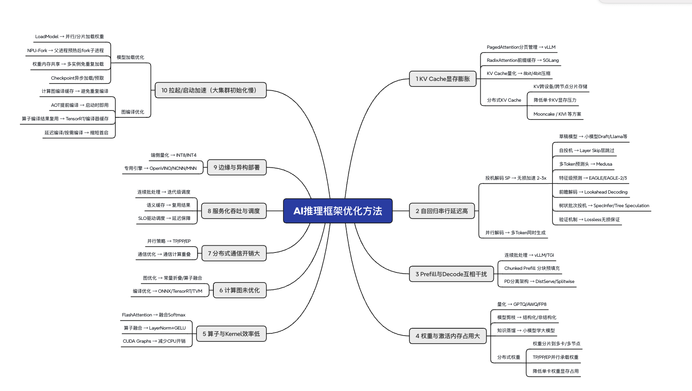

# 推理引擎

**推理引擎，顾名思义解决的是大模型的推理问题。**

给定一组到达时刻不同、长度各异的请求，把 GPU 的算力和显存压榨到极限，同时让每个用户感知到的延迟可控。

==相比训练，**推理更关注效率、延迟、吞吐量和部署可控性**，是生产环境中性能、成本和用户体验的关键驱动力。==

# 优化方法梳理

> 思维导图源文件：[AI推理框架优化方法.xmind](AI推理框架优化方法.xmind)，共 **11 大优化方向**，以下按问题→方案逐一展开，并附本仓库已有笔记。

## 总览：问题 → 方案 对应表

| # | 核心问题 | 主流方案 | 代表实现 |
|---|---------|---------|---------|
| 0 | 大集群初始化慢 | 分片并行加载、fork 预热、编译缓存 | vLLM Prewarm、TensorRT |
| 1 | KV Cache 显存膨胀 | 分页管理、前缀缓存、量化、分布式 KV | vLLM PagedAttention、SGLang RadixAttention |
| 2 | 自回归串行延迟高 | 投机解码、并行解码 | EAGLE、Medusa、SpecInfer |
| 3 | Prefill 与 Decode 调度 | Chunked Prefill、连续批处理、PD 分离 | DistServe/Splitwise |
| 4 | 权重与激活内存占用大 | 量化、剪枝、蒸馏、权重分片 | GPTQ/AWQ/FP8，TP/PP/EP |
| 5 | 算子与 Kernel 效率低 | FlashAttention、算子融合、CUDA Graphs | FA 系列及衍生实现 |
| 6 | 计算图未优化 | 图优化、编译优化 | ONNX/TensorRT/TVM |
| 7 | 分布式通信开销大 | 并行策略、通信计算重叠 | NCCL、分层通信 |
| 8 | 服务化吞吐与调度 | 连续批处理、语义缓存、SLO 驱动调度 | vLLM/TGI 迭代级调度 |
| 9 | 边缘与异构部署 | 端侧量化、专用引擎 | OpenVINO/NCNN/MNN |
| 10 | 集群通信 | 控制面（元数据/指令）+ 数据面（KV 张量） | 跨节点 KV 传输 |

## 逐项展开

### 0・拉起/启动加速（大集群初始化慢）

- **模型加载优化**
  - LoadModel → 并行/分片加载权重
  - NPU-Fork → 父进程预热后 fork 子进程
  - 权重内存共享 → 多实例免重复加载
  - Checkpoint 异步加载/预取
- **图编译优化**
  - 编译缓存、AOT 提前编译、算子编译结果复用（TensorRT/编译器缓存）、延迟编译/按需编译

### 1・KV Cache 显存膨胀

- PagedAttention 分页管理（vLLM）
- RadixAttention 前缀缓存（SGLang）
- KV Cache 量化（8bit/4bit）
- 分布式 KV Cache：跨设备/跨节点分片，Mooncake / KIVI 等方案

### 2・自回归串行延迟高 — 投机解码（无损加速 2~3x）

- 草稿模型（Draft/Llama 小模型）、自投机（Layer Skip）、多 Token 预测头（Medusa）
- 特征级预测（EAGLE-1/2/3）、前瞻解码（Lookahead）、树状批次投机（SpecInfer）
- 验证机制保证无损（Lossless）；另一路：并行解码多 Token 同时生成

### 3・Prefill 与 Decode 调度 ✅（已有笔记）

- 请求粒度：Chunked Prefill 分块预填充、连续批处理（vLLM/TGI）
- PD 分离架构：DistServe / Splitwise

### 4・权重与激活内存占用大

- 量化（GPTQ/AWQ/FP8）、剪枝（结构化/非结构化）、知识蒸馏
- 分布式权重：TP/PP/EP 并行承载、分片到多卡/多节点

### 5・算子与 Kernel 效率低

- FlashAttention（融合 Softmax）、算子融合（LayerNorm+GELU）、CUDA Graphs 消减 CPU 开销

### 6・计算图未优化

- 图优化（常量折叠/算子融合）、编译优化（ONNX/TensorRT/TVM）

### 7・分布式通信开销大

- 并行策略选择（TP/PP/EP）、通信计算重叠

### 8・服务化吞吐与调度

- 连续批处理（迭代级调度）、语义缓存复用结果、SLO 驱动调度（延迟保障）

### 9・边缘与异构部署

- 端侧量化（INT8/INT4）、专用引擎（OpenVINO/NCNN/MNN）

### 10・集群通信

- **控制面**：请求元数据、调度指令
- **数据面**：KV Cache 张量

## 本仓库笔记与导图的映射

| 导图分支 | 对应笔记 |
|---------|---------|
| 1 KV Cache 显存膨胀 | [../1.0 KV Cache/KV Cache.md](../1.0%20KV%20Cache/KV%20Cache.md) · [VLLM/KV Cache管理.md](VLLM/KV%20Cache管理.md) |
| 2 投机解码 | [优化方向/投机解码/投机解码.md](优化方向/投机解码/投机解码.md) |
| 3 PD 调度 | [优化方向/服务吞吐与调度/pd.md](优化方向/服务吞吐与调度/pd.md) |
| 4 显存不足（量化/剪枝） | [优化方向/显存不足/显存不足.md](优化方向/显存不足/显存不足.md) |
| 5+6 算子与计算图 | [优化方向/计算图优化/计算图优化.md](优化方向/计算图优化/计算图优化.md) · [../../1 底层/1.1 算子 & kernel/算子.md](../../1%20底层/1.1%20算子%20&%20kernel/算子.md) |
| 7+10 分布式/集群通信 | [优化方向/集群通信/集群通信.md](优化方向/集群通信/集群通信.md) · [../../1 底层/1.2 通信 & 分布式/多卡协同.md](../../1%20底层/1.2%20通信%20&%20分布式/多卡协同.md) |
| 8 吞吐与调度 | [优化方向/服务吞吐与调度/pd.md](优化方向/服务吞吐与调度/pd.md) |
| 0 拉起流程 | [VLLM/1 拉起流程与进程管理.md](VLLM/1%20拉起流程与进程管理.md) |
| 9 边缘部署 | ⬜ 待补充 |

待补笔记：0 启动加速、7 通信计算重叠、9 端侧部署。

