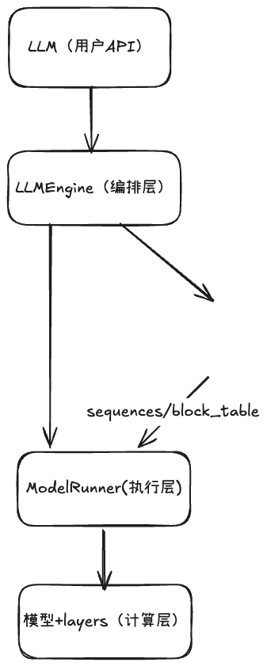
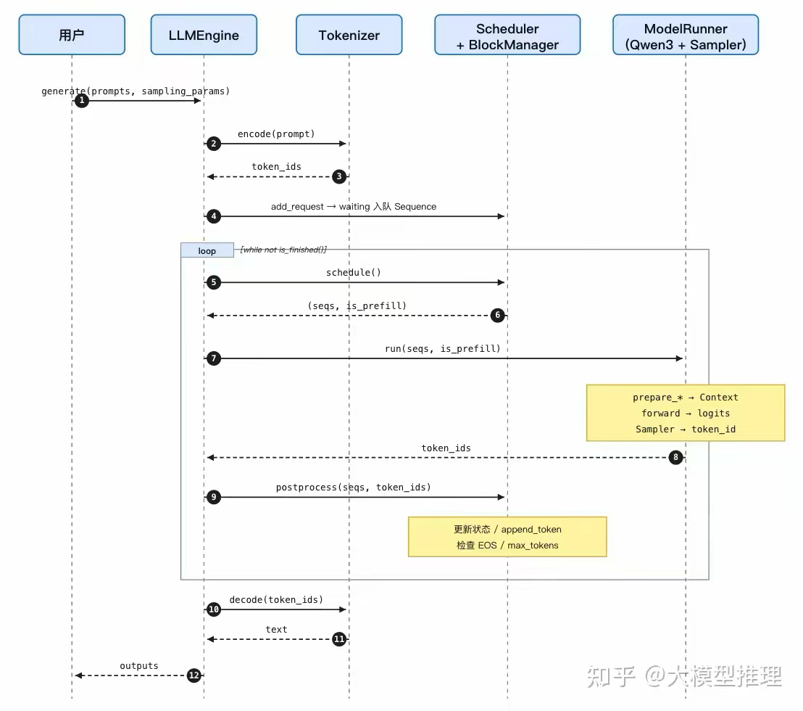

# nano-vllm整体架构



三层各自的”独立性测试”——换掉任何一层，其它两层不需要动：

编排层（LLMEngine） 知道”用户有 prompt”，不知道”模型如何前向”。它的工作就是：把 prompts 转成 Sequence、起 step 循环、把完成的序列汇总给 tokenizer 解码。换底层模型，这一层不动。

资源层（Scheduler + BlockManager） 知道”显存里有 N 个 KV 块”，不知道”模型里有几层 attention”。它决定哪些序列这个 step 跑、哪些块该分配 / 释放 / 复用。换 attention 实现，这一层不动。

资源层（Scheduler + BlockManager） 知道”显存里有 N 个 KV 块”，不知道”模型里有几层 attention”。它决定哪些序列这个 step 跑、哪些块该分配 / 释放 / 复用。换 attention 实现，这一层不动。


# 一条prompt端到端调用链条

example.py：

```python
from nanovllm import LLM, SamplingParams

llm = LLM("/YOUR/MODEL/PATH", enforce_eager=True, tensor_parallel_size=1)
sampling_params = SamplingParams(temperature=0.6, max_tokens=256)
prompts = ["Hello, Nano-vLLM."]
outputs = llm.generate(prompts, sampling_params)
```

generate() 内部的骨架（engine/llm_engine.py:60）：

```python
def generate(self, prompts, sampling_params, use_tqdm=True):
    for prompt, sp in zip(prompts, sampling_params):
        self.add_request(prompt, sp)        # 1. 入队
    while not self.is_finished():           # 2. step 直到全部完成
        output, num_tokens = self.step()
        for seq_id, token_ids in output:
            outputs[seq_id] = token_ids
    return [tokenizer.decode(...) for ...]  # 3. 解码
```

