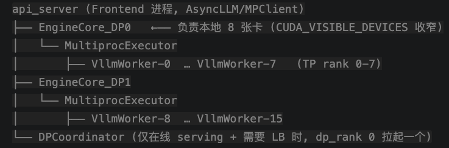

# 进程管理

## 进程视图




### EngineProcManager 拉起EngineCore


utils.py:142-155

```python
# 已完成地址协商 get_engine_zmq_addresses ，本机共置时用 ipc://，跨机用 tcp://），然后绑定一个 ROUTER handshake socket

for index in range(local_engine_count):
    local_index = local_start_index + index
    global_index = start_index + index

    # Start EngineCore in background process.
    local_dp_ranks.append(local_index)
    self.processes.append(
        context.Process(
            target=EngineCoreProc.run_engine_core,
            name=f"EngineCore_DP{global_index}" if is_dp else "EngineCore",
            kwargs=common_kwargs
            | {"dp_rank": global_index, "local_dp_rank": local_index},
        )
    )
 
#每个 DP rank 拉起时会用 set_device_control_env_var() + numa_utils.configure_subprocess() 把可见 GPU 收窄到自己的 8 张卡并做 NUMA 绑核——这就是 DP=2 时两个 EngineCore 各管 8 张卡的方式。
```


# 拉起流程

入口文件：basic.py:17:main()

```python
def main():
    # Create an LLM.
    llm = LLM(model="facebook/opt-125m")//模型初始化
    # Generate texts from the prompts.
    # The output is a list of RequestOutput objects
    # that contain the prompt, generated text, and other information.
    outputs = llm.generate(prompts, sampling_params)//prompt 推理
    # Print the outputs.
    print("\nGenerated Outputs:\n" + "-" * 60)
    for output in outputs:
        prompt = output.prompt
        generated_text = output.outputs[0].text
        print(f"Prompt:    {prompt!r}")
        print(f"Output:    {generated_text!r}")
        print("-" * 60)
```

## 不同 TP/DP 配置下的进程启动策略

- **单节点 TP=16**：DP=1，本地 DP 等于全局 DP，只起一个 `EngineCoreProc`。
- **双节点 TP=16**：DP=2，但每个节点本地 DP 为 1，因此每个节点各起一个 `EngineCoreProc`，总共两个。
- **单节点 TP=8**：DP=2，虽然 `CoreEngineProcManager` 只有一个，但会在本节点内拉起两个 `EngineCoreProc`。

## 一条prompt 端对端流程

```python
from vllm import LLM, SamplingParams

# Sample prompts.
prompts = [
    "Hello, my name is",
    "The president of the United States is",
    "The capital of France is",
    "The future of AI is",
]
# Create a sampling params object.
sampling_params = SamplingParams(temperature=0.8, top_p=0.95)


def main():
    # Create an LLM.
    llm = LLM(model="facebook/opt-125m")
    # Generate texts from the prompts.
    # The output is a list of RequestOutput objects
    # that contain the prompt, generated text, and other information.
    outputs = llm.generate(prompts, sampling_params)
    # Print the outputs.
    print("\nGenerated Outputs:\n" + "-" * 60)
    for output in outputs:
        prompt = output.prompt
        generated_text = output.outputs[0].text
        print(f"Prompt:    {prompt!r}")
        print(f"Output:    {generated_text!r}")
        print("-" * 60)


if __name__ == "__main__":
    main()
```

generate 核心代码

offline_utils.py:573:_run_engine()


