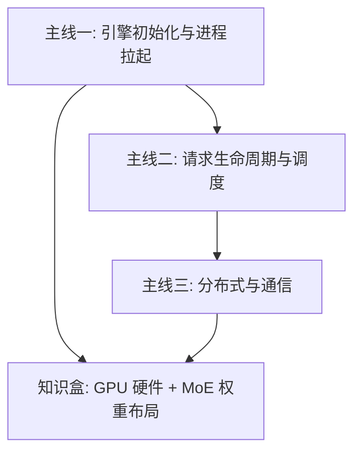

# 导读

> 本文档是整个知识库的地图，以 **vLLM 主线**为核心展开：三条学习主线 + 一个硬件/MoE 知识盒，其余目录为支撑层。手绘版见 [导读.excalidraw](导读.excalidraw)。

---

## 一、知识库结构总览

```
knowlege_library/
├── 100000 大模型综述/          # 入口：学习大纲 + 面试题整理
├── 0 LLM/                      # 原理层：Attention、编解码、激活函数、精度
├── 1 底层/                     # 硬件层
│   ├── 1.0 GPU&异构计算        # CUDA
│   ├── 1.1 算子 & kernel
│   ├── 1.2 集群通信            # NCCL / NVLink / IB / 超节点
│   ├── 1.3 pytorch底层
│   └── 1.4 KV Cache
├── 2 框架/                     # 框架层（当前主线）
│   └── 1.1 推理架构
│       ├── 推理引擎/           # vLLM / SGLang / Nano-Vllm / FLowserve
│       ├── 推理并行/           # TP/PP/DP/EP/SP
│       ├── 性能估算/
│       └── 优化方向/           # 投机解码 / 显存优化 / 吞吐调度 / 计算图 / 通信
├── computer_basecs/            # 计算机基础：OS / 网络 / 数据结构 / K8s
├── paper/                      # 论文笔记：DeepSeek / 量化 / 推理效率
├── 工具/                       # git / linux / k8s 速查
├── 工程问题/                   # 开发踩坑记录
├── question-bank/ + data/      # 题库数据（JSON）
├── 3 编译器& Runtime/          # 待建设
├── 4 集群& 平台/               # 待建设
└── code_practice/              # 待建设
```

---

## 二、主线地图（对应 导读.excalidraw）



### 主线一：引擎初始化与进程拉起

核心问题：**从一个 `LLM` 调用到进程树真正跑起来，中间发生了什么？**

1. 入口：`LLM` → `LLMEngine.from_engine_args` → `LLMEngine` / `EngineCore`
2. 拉起：`super._init` → `MPCclient with launch_core_engines`（先 init engine 拉起后续进程，再连接所有东西，置一个状态位）
3. Ray 路径：create actor 三步（init → Prewarm → create），`CoreEngineActorManager` → `ray.remote(DPEngineCoreActor)` + `PlacementGroupSchedulingStrategy` 按 `placement_group_bundle_index` 分配
4. 请求入口：`def add_req`（req1/req2/req3 并发进入 LLM engine）
5. Worker 侧初始化链路：
   - `WorkerProc` → `WorkerWrapperBase.init_worker` → `load_model`
   - `init_worker_distributed_environment`：init_batch_invariance → override_envs_for_eplb → set_custom_all_reduce → init_distributed_environment → ensure_model_parallel_initialized → ensure_ec_transfer_initialized → modelRunner
   - `init_distributed_environment` 内部：rank/world_size 调整、按节点数选 IP/端口初始化、NCCL 不可用回退 Gloo、Elastic EP 支持、多节点 TP/PP 检查
   - Master/slaver 进程组形态：`torch.distributed.new_group(ranks)` 按 group_ranks 循环建组 → `GroupCoordinator` 管理

📖 对应笔记：

- [VLLM 拉起流程与进程管理](2%20框架/1.1%20推理架构/推理引擎/VLLM/1%20拉起流程与进程管理.md)（主战场）
- [Nano-Vllm 对照版](2%20框架/1.1%20推理架构/推理引擎/Nano-Vllm/1%20拉起流程与进程管理.md)（精简版）
- [SGLang](2%20框架/1.1%20推理架构/推理引擎/SGLang/1%20拉起流程与进程管理.md) · [FLowserve](2%20框架/1.1%20推理架构/推理引擎/FLowserve/1%20拉起流程与进程管理.md)

### 主线二：请求生命周期与调度

核心问题：**一条 prompt 从封装到 finish，经过哪些状态？**

1. `prompt "i love beijing"` → 分词 → token id `[25, 36, 102]` → 封装成 `SequenceGroup1`
2. `_add_request` 进入 **waiting list**：`[SG1, SG2, ...]`
3. `Scheduler` 消费：对请求划分 → prefill / long_extend / short_extend / decode 四种形态
4. 进入 **running list**：`[SG1_p, SG3_d, ...]`（状态后缀 p/d/done 表示阶段）
5. 每步向 `BlockManager` 询问是否有空间（KV cache 资源仲裁）→ 刷新 running list → 通知刷新 table 维护表
6. 循环判断：`if running & token_budget > 0` 继续产出 output → `if running == []` → finish（可中途 abort）
7. 三种模式佐证：`multiprocess_mode & asyncio_mode & 多dp & data_parallel_external_lb`

📖 对应笔记：

- [KV Cache](1%20底层/1.4%20KV%20Cache/KV%20Cache.md)（BlockManager 的前置概念）
- [VLLM KV Cache 管理](2%20框架/1.1%20推理架构/推理引擎/VLLM/KV%20Cache管理.md)
- [PD 分离](2%20框架/1.1%20推理架构/优化方向/服务吞吐与调度/pd.md)（prefill/decode 分离）
- [VLLM metrics](2%20框架/1.1%20推理架构/推理引擎/VLLM/metrics.md)

### 主线三：分布式与通信

核心问题：**dp/tp/ep 到底是怎么组成进程组的？**

- Executor 两条路径：**ray**（CoreEngineProcManager，dpsize 个 `EngineCoreProc`）vs **非 ray**（MultiprocExecutor，dp 个 `WorkerProc`，local_world_size 个子进程，每个 workerproc 起 worker_main）
- Client 侧选路：`EngineCoreClient` → DPLBAsyncMPClient；dp 分布在**单节点** vs **多节点**（`data_parallel_external_lb`）
- 进程组拓扑：Master + slaver 形态（process group），dp group 拿到的是通讯数据 processgroup

📖 对应笔记：

- [集群通信](1%20底层/1.2%20集群通信/集群通信.md)（多卡协同）
- [NCCL](1%20底层/1.2%20集群通信/ncll.md) · [NVLink](1%20底层/1.2%20集群通信/nvlink.md) · [InfiniBand](1%20底层/1.2%20集群通信/InfiniteBand%28IB%29.md) · [A5 超节点网络](1%20底层/1.2%20集群通信/A5超节点网络.md)
- [集群通信优化](2%20框架/1.1%20推理架构/优化方向/集群通信优化/集群通信优化.md)（框架视角）
- [5P 推理](2%20框架/1.1%20推理架构/推理并行/5p推理.md)（TP/PP/DP/EP/SP 五种并行原理）

### 知识盒：GPU 硬件层级 + MoE 权重布局

**硬件存储层级**（速度递减、容量递增）：

SRAM（L1，SM 独有）→ L2（SM 共享）→ HBM3（显存）→ DRAM / RAM / SSD

**MoE 权重布局**（以 GLM5.1 / DeepSeek 类结构为样本）：

- `global dense x3` + `subdense`，每层 `experts x75` + `shared_experts` + 冗余 experts
- `mlp` 三件套：mlp / mlp_shared / mlp_experts

**CPU↔GPU 地址映射问题**（图中批注的核心思考）：

- 方式1：CPU 直接获取 PA（物理地址）→ 问题：CPU 得不停查询地址，必须整块缓存，中间断了不好搞
- 方式2：向 GPU 索要虚拟地址 → MMU → block table（byte1/byte2 → PA1/PA2 → logits/logit1）

📖 对应笔记：

- [CUDA](1%20底层/1.0%20GPU&异构计算/CUDA.md) · [算子](1%20底层/1.1%20算子%20&%20kernel/算子.md)
- [DeepSeek 论文](paper/deepseek/deepseek.md)（MoE 结构出处）
- [精度](0%20LLM/精度/精度.md)

---

## 三、支撑层目录

### 原理层 —— 0 LLM

| 目录 | 内容 |
|---|---|
| [Attention](0%20LLM/Attention/attention相关知识.md) | attention 相关知识 |
| [句子编解码](0%20LLM/句子编解码/句子编解码.md) | 分词 / [位置编码](0%20LLM/句子编解码/位置编码.md) |
| [激活函数](0%20LLM/激活函数/激活函数.md) | 激活函数 |
| [精度](0%20LLM/精度/精度.md) | fp16 / bf16 / int8 量化精度 |
| [其余](0%20LLM/其余/Norm.md) | Norm 归一化 |

### 基础层 —— computer_basecs + 工具

- 笔记：[操作系统](computer_basecs/操作系统.md) · [数据结构](computer_basecs/数据结构.md) · [计算机网络](computer_basecs/计算机网络.md) · [K8s](computer_basecs/K8s.md)
- 速查：[Git](工具/Git.md) · [linux常用命令](工具/linux常用命令.md) · [k8常用命令](工具/k8常用命令.md)

### 论文层 —— paper

- [DeepSeek](paper/deepseek/deepseek.md) · [高效推理](paper/Efficient_llm_inference/efficient_llm_inference.md) · [量化](paper/Quantization/Quantization.md) · [KV cache 论文](paper/KV%20cache%20论文.md)

### 工程层 —— 2 框架其他子目录

- [性能估算](2%20框架/1.1%20推理架构/性能估算/性能估算.md) · [训练框架](2%20框架/1.2%20训练框架/训练框架.md) · [server](2%20框架/1.3%20server/server.md) · [pytorch底层](1%20底层/1.3%20pytorch底层/pytorch.md) · [踩坑记录](工程问题/显存oom.md)

### 优化方向（2 框架/1.1 推理架构/优化方向）

[投机解码](2%20框架/1.1%20推理架构/优化方向/投机解码/投机解码.md) · [显存优化与offload](2%20框架/1.1%20推理架构/优化方向/显存优化与offload/显存优化与offload.md) · [服务吞吐与调度](2%20框架/1.1%20推理架构/优化方向/服务吞吐与调度/pd.md) · [计算图优化](2%20框架/1.1%20推理架构/优化方向/计算图优化/计算图优化.md) · [集群通信优化](2%20框架/1.1%20推理架构/优化方向/集群通信优化/集群通信优化.md)

> 五个独立优化维度，建议读完主线一、二后再回来看。

---

## 四、待建设（空目录）

- [ ] `3 编译器& Runtime/`：Triton / TorchDynamo / TVM 方向
- [ ] `4 集群& 平台/`：K8s + GPU 调度器方向
- [ ] `code_practice/`

---

## 五、建议学习顺序

1. **综述**：[100000 大模型综述](100000%20大模型综述/学习大纲-面试题目/) → 建立全局问题意识
2. **原理**：0 LLM 全部（Attention / 编解码 / 精度 / 激活函数）
3. **主线一**：VLLM 拉起流程 → Nano-VLLM 对照 → SGLang / FLowserve 差异
4. **主线二**：KV Cache → 请求生命周期 → 优化方向
5. **主线三**：集群通信 → NCCL / NVLink / IB → 5P 推理
6. **收尾**：优化方向五专题 + paper，最后补 3/4 空目录
