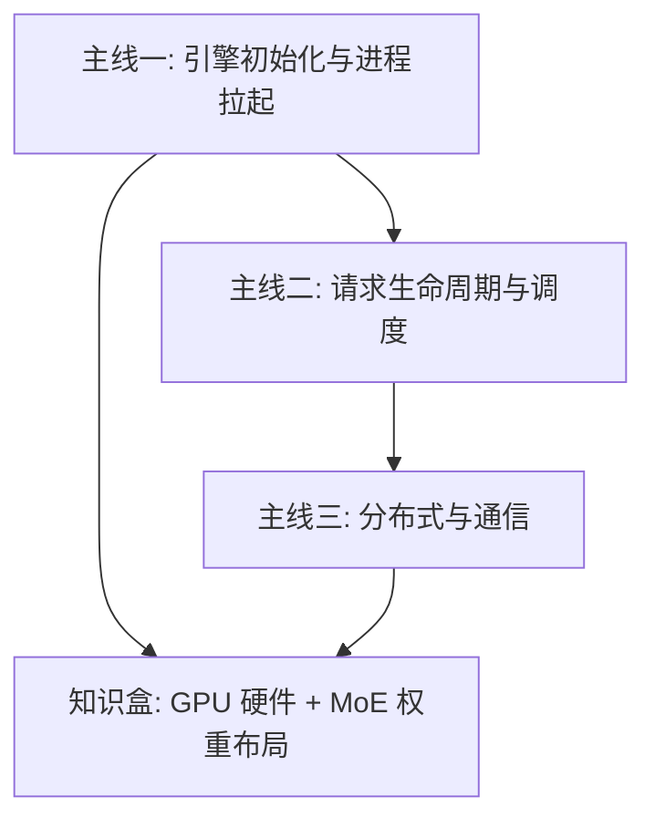

# 导读

> 本目录是整个知识库的地图。手绘版见 [导读.excalidraw](导读.excalidraw)，以 **vLLM 主线**为核心展开，三条学习主线 + 一个硬件/MoE 知识盒，其余目录为支撑层。

---

## 一、知识库结构总览

```
knowlege_library/
├── 100000 大模型综述/        # 入口：学习大纲 + 面试题整理
├── 0 LLM/                    # 原理层：Attention、编解码、精度、并行等
├── 1 底层/                   # 硬件层：CUDA、算子、通信
├── 2 框架/                   # 框架层：vLLM/SGLang 等推理框架（当前主线）
├── 3 编译器& Runtime/        # 待建设
├── 4 集群& 平台/             # 待建设
├── computer_basecs/          # 计算机基础
├── paper/                    # 论文笔记
├── code_practice/            # 待建设
├── 工具/                     # git/linux/k8s 速查
└── 额外知识/                 # 开发踩坑记录
```

---

## 二、主线地图（对应 导读.excalidraw）



### 主线一：引擎初始化与进程拉起（excalidraw 左侧主线）

核心问题：**从一个 `LLM` 调用到进程树真正跑起来，中间发生了什么？**

1. 入口：`LLM` → `LLMEngine.from_engine_args` → `LLMEngine` / `EngineCore`
2. 拉起：`super._init` → `MPCclient with launch_core_engines`（先 init engine 拉起后续进程，再连接所有东西，置一个状态位）
3. Ray 路径：create actor 三步（init → Prewarm → create），`CoreEngineActorManager` → `ray.remote(DPEngineCoreActor)` + `PlacementGroupSchedulingStrategy` 按 `placement_group_bundle_index` 分配
4. 请求入口：`def add_req`（req1/req2/req3 并发进入 LLM engine）
5. Worker 侧初始化链路：
   - `WorkerProc` → `WorkerWrapperBase.init_worker` → `load_model`
   - `init_worker_distributed_environment`：init_batch_invariance → override_envs_for_eplb → set_custom_all_reduce → init_distributed_environment → ensure_model_parallel_initialized → ensure_ec_transfer_initialized → modelRunner
   - `init_distributed_environment` 内部：rank/world_size 调整、按节点数选 IP/端口初始化、NCCL 不可用回退 Gloo、Elastic EP 支持、多节点 TP/PP 检查
   - Master/slaver 进程组形态：`torch.distributed.new_group(ranks)` 按 group_ranks 循环建组 → `GroupCoordinator` 管理

📖 对应笔记：
- [2 框架/1.1 推理架构/VLLM/1 拉起流程与进程管理.md](2%20框架/1.1%20推理架构/VLLM/1%20拉起流程与进程管理.md)（主战场）
- [2 框架/1.1 推理架构/Nano-Vllm/1 拉起流程与进程管理.md](2%20框架/1.1%20推理架构/Nano-Vllm/1%20拉起流程与进程管理.md)（精简对照版）
- [2 框架/1.1 推理架构/SGLang/1 拉起流程与进程管理.md](2%20框架/1.1%20推理架构/SGLang/1%20拉起流程与进程管理.md)
- [2 框架/1.1 推理架构/FLowserve/1 拉起流程与进程管理.md](2%20框架/1.1%20推理架构/FLowserve/1%20拉起流程与进程管理.md)
- 源码级：[2 框架/1.1 推理架构/VLLM源码阅读/VLLM源码阅读.md](2%20框架/1.1%20推理架构/VLLM源码阅读/VLLM源码阅读.md)

### 主线二：请求生命周期与调度（excalidraw 右侧两大块）

核心问题：**一条 prompt 从封装到 finish，经过哪些状态？**

1. `prompt "i love beijing"` → 分词 → token id `[25, 36, 102]` → 封装成 `SequenceGroup1`
2. `_add_request` 进入 **waiting list**：`[SG1, SG2, ...]`
3. `Scheduler` 消费：对请求划分 → prefill / long_extend / short_extend / decode 四种形态
4. 进入 **running list**：`[SG1_p, SG3_d, ...]`（状态后缀 p/d/done 表示阶段）
5. 每步向 `BlockManager` 询问是否有空间（KV cache 资源仲裁）→ 刷新 running list → `通知刷新 table 维护表`
6. 循环判断：`if running & token_budget > 0` 继续产出 output1/output2/output3 → `if running == []` → finish（可中途 abort）
7. 三种模式佐证：`multiprocess_mode & asyncio_mode & 多dp & data_parallel_external_lb`

📖 对应笔记：
- [2 框架/1.0 KV Cache/KV Cache.md](2%20框架/1.0%20KV%20Cache/KV%20Cache.md)（BlockManager 的前置概念）
- [2 框架/1.1 推理架构/VLLM/KV Cache管理.md](2%20框架/1.1%20推理架构/VLLM/KV%20Cache管理.md)
- [2 框架/1.1 推理架构/优化方向/服务吞吐与调度/pd.md](2%20框架/1.1%20推理架构/优化方向/服务吞吐与调度/pd.md)（prefill/decode 分离）
- [2 框架/1.1 推理架构/VLLM/metrics.md](2%20框架/1.1%20推理架构/VLLM/metrics.md)

### 主线三：分布式与通信（excalidraw 中部）

核心问题：**dp/tp/ep 到底是怎么组成进程组的？**

- Executor 两条路径：**ray**（CoreEngineProcManager，dpsize 个 `EngineCoreProc`） vs **非 ray**（MultiprocExecutor，dp 个 `WorkerProc`，local_world_size 个子进程，每个 workerproc 起 worker_main）
- Client 侧选路：`EngineCoreClient` → DPLBAsyncMPClient；dp 分布在**单节点** vs **多节点**（`data_parallel_external_lb`）
- 进程组拓扑：Master + slaver 形态（process group），dp group 拿到的是通讯数据 processgroup

📖 对应笔记：
- [1 底层/1.2 通信 & 分布式/多卡协同.md](1%20底层/1.2%20通信%20&%20分布式/多卡协同.md)
- [1 底层/1.2 通信 & 分布式/ncll.md](1%20底层/1.2%20通信%20&%20分布式/ncll.md) · [nvlink.md](1%20底层/1.2%20通信%20&%20分布式/nvlink.md) · [InfiniteBand(IB).md](1%20底层/1.2%20通信%20&%20分布式/InfiniteBand(IB).md) · [A5超节点网络.md](1%20底层/1.2%20通信%20&%20分布式/A5超节点网络.md)
- [2 框架/1.1 推理架构/优化方向/集群通信/集群通信.md](2%20框架/1.1%20推理架构/优化方向/集群通信/集群通信.md)
- [0 LLM/推理并行/5p推理.md](0%20LLM/推理并行/5p推理.md)（TP/PP/DP/EP/SP 五种并行的原理层）

### 知识盒：GPU 硬件层级 + MoE 权重布局（excalidraw 右下大绿块）

**硬件存储层级**（速度递减、容量递增）：SRAM（L1，SM 独有）→ L2（SM 共享）→ HBM3（显存）→ DRAM / RAM / SSD

**MoE 权重布局**（以 GLM5.1 / DeepSeek 类结构为样本）：
- `global dense x3` + `subdense`，每层 `experts x75` + `shared_experts` + 冗余 experts
- `mlp` 三件套：mlp / mlp_shared / mlp_experts

**CPU↔GPU 地址映射问题**（图中批注的核心思考）：
- 方式1：CPU 直接获取 PA（物理地址）→ 问题：CPU 得不停查询地址，必须整块缓存，中间断了不好搞
- 方式2：向 GPU 索要虚拟地址 → MMU → block table（byte1/byte2 → PA1/PA2 → logits/logit1）

📖 对应笔记：
- [1 底层/1.0 GPU&异构计算/CUDA.md](1%20底层/1.0%20GPU&异构计算/CUDA.md)
- [1 底层/1.1 算子 & kernel/算子.md](1%20底层/1.1%20算子%20&%20kernel/算子.md)
- [paper/deepseek/deepseek.md](paper/deepseek/deepseek.md)（MoE 结构出处）
- [0 LLM/精度/精度.md](0%20LLM/精度/精度.md)

---

## 三、支撑层目录

### 原理层 —— 0 LLM
| 目录 | 内容 | 状态 |
|---|---|---|
| Attention | attention 相关知识 | 🟩 |
| 句子编解码 | 分词/位置编码 | 🟩 |
| 激活函数 | 激活函数 | 🟩 |
| 精度 | fp16/bf16/int8 量化精度 | 🟩 |
| 推理并行 | 5 种并行原理 | 🟩 |
| 其余 | Norm 归一化 | 🟩 |
| metrics | | ⬜ 空 |

### 基础层 —— computer_basecs + 工具
- [操作系统](computer_basecs/操作系统.md) · [数据结构](computer_basecs/数据结构.md) · [计算机网络](computer_basecs/计算机网络.md) · [K8s](computer_basecs/K8s.md)
- 速查：[Git](工具/Git.md) · [linux常用命令](工具/linux常用命令.md) · [k8常用命令](工具/k8常用命令.md)

### 进阶层 —— paper
- [deepseek](paper/deepseek/deepseek.md)
- [Efficient_llm_inference](paper/Efficient_llm_inference/efficient_llm_inference.md)
- [Quantization](paper/Quantization/Quantization.md)
- [KV cache 论文](paper/KV%20cache%20论文.md)

### 优化方向（2 框架/1.1 推理架构/优化方向）
投机解码 · 显存不足 · 服务吞吐与调度 · 计算图优化 · 集群通信 —— 五个独立优化维度，在读完主线一二后再回来看。

---

## 四、待建设（空目录）

- [ ] `3 编译器& Runtime/`：Triton / TorchDynamo / TVM 方向
- [ ] `4 集群& 平台/`：K8s + GPU 调度器方向
- [ ] `code_practice/`
- [ ] `0 LLM/metrics/`

## 五、建议学习顺序

1. **综述**：100000 大模型综述/学习大纲-面试题目 → 建立全局问题意识
2. **原理**：0 LLM 全部 + 推理并行
3. **主线一**：VLLM 拉起流程 → Nano-VLLM 对照 → SGLang/FLowserve 差异
4. **主线二**：KV Cache → 抽象概念 → 源码阅读
5. **主线三**：多卡协同 → nccl/nvlink/IB
6. **优化方向** + paper，最后补 3/4 空目录
